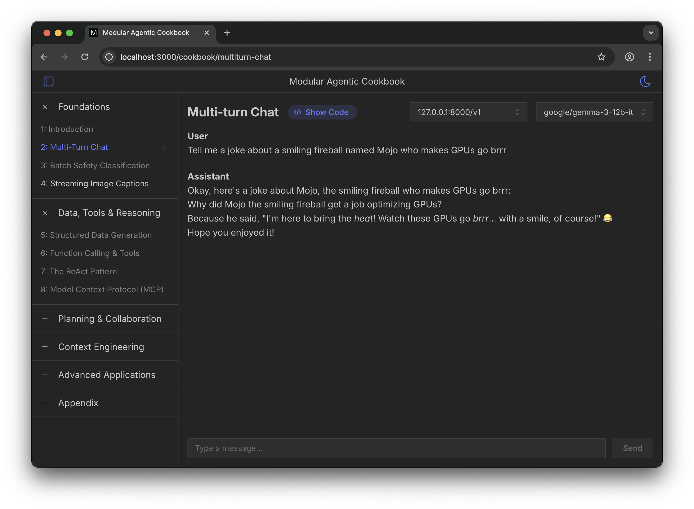

# Modular Agentic Cookbook

A collection of recipes demonstrating how to build modern fullstack web apps using Modular MAX, Next.js, and the Vercel AI SDK. Each recipe demonstrates an end-to-end workflow with both frontend and backend implementations, including detailed code comments.

> **📦 Looking for legacy recipes?** Older standalone recipes have been moved to the [`archive`](https://github.com/modular/max-agentic-cookbook/tree/archive) branch. These are provided as-is for historical reference only and are no longer maintained.

<figure>
  
  <figcaption style='display: none'>
    Example conversation: User asks for a joke about Mojo, the smiling fireball who makes GPUs go brrr. The assistant responds: "Why did Mojo the smiling fireball get a job optimizing GPUs? Because he said, 'I'm here to bring the heat! Watch these GPUs go brrr... with a smile, of course! Hope you enjoyed it!'"
  </figcaption>
</figure>

## Requirements

- **Node.js** 22.x or higher
- **pnpm** package manager
- **MAX** server running locally or remotely—see the [MAX quickstart](https://docs.modular.com/max/get-started/)

## Quick Start

1. **Clone and install**

    ```bash
    git clone https://github.com/modular/max-agentic-cookbook.git
    cd max-agentic-cookbook
    pnpm install
    ```

2. **Configure endpoints**

    ```bash
    cp .sample.env .env.local
    ```

    Edit `.env.local` to add your MAX endpoint (or any OpenAI-compatible server):

    ```env
    COOKBOOK_ENDPOINTS='[
      {
        "id": "max-local",
        "baseUrl": "http://127.0.0.1:8000/v1",
        "apiKey": "EMPTY"
      }
    ]'
    ```

3. **Start developing**

    ```bash
    pnpm dev
    ```

    Open [http://localhost:3000](http://localhost:3000) in your browser

## Featured Recipes

### 1. **Multi-turn Chat**

Build a streaming chat interface that maintains conversation context across multiple exchanges. This recipe demonstrates:

- Real-time token streaming using the Vercel AI SDK
- Markdown rendering with syntax-highlighted code blocks using Streamdown
- Auto-scrolling message display with smart scroll detection
- Seamless compatibility with Modular MAX and OpenAI-compatible endpoints

### 2. **Image Captioning**

Create an intelligent image captioning system that generates natural language descriptions for uploaded images with progressive streaming and performance tracking. Features include:

- **NDJSON streaming**: Custom useNDJSON hook for progressive results—captions appear as they're generated
- **Parallel processing**: Multiple images processed simultaneously for maximum speed
- **Performance metrics**: TTFT (time to first token) and duration tracking
- Drag-and-drop image upload with Mantine Dropzone
- Customizable prompt for caption generation
- Gallery view with loading states and real-time updates

## Architecture

The cookbook is organized as a pnpm workspace monorepo with a clean separation between the Next.js app and shared recipe implementations:

```plaintext
├── apps/cookbook/           # Next.js 14 App
│   ├── app/                 # App Router pages & API routes
│   ├── components/          # UI components
│   └── context/             # React context
│
└── packages/recipes/        # Shared recipe implementations
    └── src/
        ├── multiturn-chat/  # Each recipe has:
        │   ├── api.ts       # - Backend API logic
        │   └── ui.tsx       # - Frontend UI component
        └── image-captioning/
```

For a deep dive into the architecture, see the [Architecture Guide](./docs/architecture.md).

## Adding New Recipes

Create a directory under `packages/recipes/src/your-recipe-name/` with:

- **`ui.tsx`** - Frontend React component with inline documentation
- **`api.ts`** - Backend API handler using Vercel AI SDK

Each recipe follows consistent patterns: React hooks for state management, Mantine UI components, and detailed inline comments explaining architecture decisions and data flow.

For detailed instructions, see the [Contributing Guide](./docs/contributing.md).

## Using with MAX

Start MAX model serving ([see quickstart](https://docs.modular.com/max/get-started/)):

```bash
max serve --model google/gemma-3-27b-it
```

Configure the endpoint in `.env.local` and select it in the cookbook UI. The cookbook works with MAX or any OpenAI-compatible API.

## Docker Deployment

The cookbook can run entirely in Docker with MAX model serving included. Build with:

```bash
docker build --ulimit nofile=65535:65535 -t max-cookbook:latest .
```

Run with GPU support (NVIDIA example):

```bash
docker run --gpus all \
    -v ~/.cache/huggingface:/root/.cache/huggingface \
    -e "HF_TOKEN=your-token" \
    -e "MAX_MODEL=mistral-community/pixtral-12b" \
    -p 8000:8000 -p 3000:3000 \
    max-cookbook:latest
```

The container supports both NVIDIA and AMD GPUs. For detailed instructions including AMD setup, build arguments, and troubleshooting, see the [Docker Guide](./docs/docker.md).

## Available Scripts

- `pnpm dev` - Start development server with hot reloading (uses Turbopack)
- `pnpm build` - Build production-optimized bundle
- `pnpm start` - Run production server
- `pnpm lint` - Run ESLint checks
- `pnpm format` - Format code with Prettier
- `pnpm format:check` - Check code formatting

## Learning Resources

The best way to learn is by running the cookbook and exploring the recipes. Toggle "Show Code" in the UI to see implementations alongside demos. Each recipe contains extensive inline documentation explaining architecture decisions and integration patterns.

**Documentation:**

- [Modular MAX](https://docs.modular.com/)
- [Vercel AI SDK](https://sdk.vercel.ai/docs)
- [Next.js](https://nextjs.org/docs)
- [Mantine UI](https://mantine.dev/)

## Contributing

Contributions welcome! Fork the repo, create a feature branch, follow established patterns, and submit a pull request. Ensure proper TypeScript types and comprehensive inline documentation.

See the [Contributing Guide](./docs/contributing.md) for detailed instructions on adding recipes, code standards, and the PR process.

## Support

- **Issues**: [GitHub Issues](https://github.com/modular/max-recipes/issues)
- **Discussions**: [Modular Forum](https://forum.modular.com/)
- **Community**: [Discord](https://discord.gg/modular)
