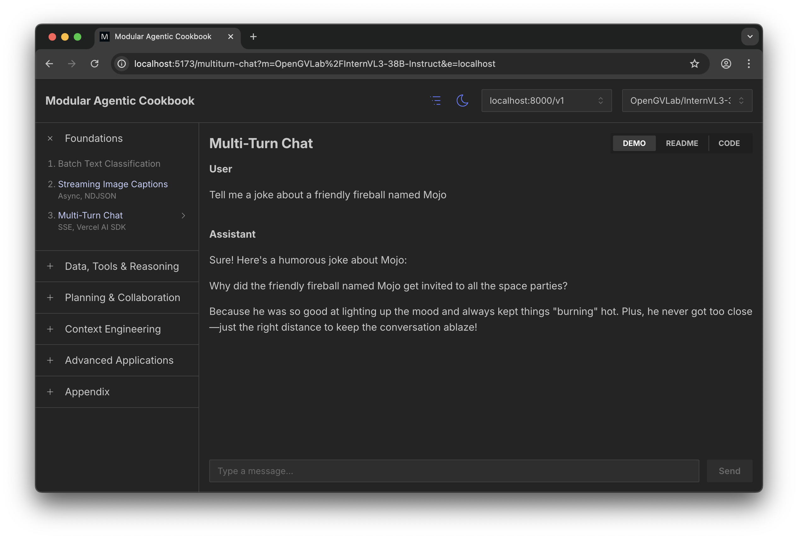

# MAX Agentic Cookbook

This repo contains a modern fullstack cookbook app showcasing the agentic AI capabilities of Modular MAX as a complete LLM serving solution. It's built with FastAPI (Python) and React (TypeScript), optimizing for developer familiarity and flexibility.



> **📦 Looking for legacy recipes?** Older standalone recipes have been moved to the [`archive`](https://github.com/modular/max-agentic-cookbook/tree/archive) branch. These are provided as-is for historical reference only and are no longer maintained.

## Requirements

-   **Python** 3.11 or higher; we recommend [uv 0.7+](https://github.com/astral-sh/uv) for working with Python
-   **Node.js** 22.x or higher; we recommend [pnpm 10.17+](https://pnpm.io/installation) for working with Node.js

## Quick Start

### Clone the repo

```bash
git clone https://github.com/modular/max-agentic-cookbook.git
cd max-agentic-cookbook
```

### Set up your LLM endpoint

```bash
cp backend/.sample.env backend/.env.local
```

Open `backend/.env.local` in your favorite text editor and supply a valid MAX or OpenAI-compatible endpoint:

```env
COOKBOOK_ENDPOINTS='[
  {
    "id": "max-local",
    "baseUrl": "http://localhost:8000/v1",
    "apiKey": "EMPTY"
  }
]'
```

### Install dependencies

```bash
cd backend && uv sync
cd ..
cd frontend && npm install
```

### Run the app

#### Run with VS Code

The Cookbook contains a VS Code configuration in `.vscode`, preconfigured for full-stack debugging.

1. Open the `max-agentic-cookbook` folder in VS Code
2. Open the Run & Debug panel
3. Choose _Full-Stack Debug_

#### Run in the terminal

You can run the backend and frontend separately by using two terminal sessions.

Terminal 1 (Python Backend):

```bash
cd backend
uv run dev
```

You will find the FastAPI backend server running at `http://localhost:8010`.

Terminal 2 (React Frontend):

```bash
cd frontend
npm run dev
```

The React frontend app will be available in your browser at `http://localhost:5173`. (Note: vite may server the frontend on a port other than 5173; always refer to your actual terminal output.)

#### Run with Docker

You can run the complete stack with MAX model serving + backend + frontend in a single container.

**Note:** For the best experience, we recommend running on a machine with a [compatible GPU](https://docs.modular.com/max/packages/#gpu-compatibility). Visit [MAX Builds](https://builds.modular.com/?category=models) to see which MAX models on available for GPU and CPU.

```bash
# Build
docker build -t max-cookbook .

# Run (NVIDIA GPU)
docker run --gpus all \
    -v ~/.cache/huggingface:/root/.cache/huggingface \
    -e "HF_TOKEN=your-huggingface-token" \
    -e "MAX_MODEL=mistral-community/pixtral-12b" \
    -p 8000:8000 -p 8010:8010 \
    max-cookbook

# Run (AMD GPU)
docker run \
    --group-add keep-groups \
    --device /dev/kfd --device /dev/dri \
    -v ~/.cache/huggingface:/root/.cache/huggingface \
    -e "HF_TOKEN=your-huggingface-token" \
    -e "MAX_MODEL=mistral-community/pixtral-12b" \
    -p 8000:8000 -p 8010:8010 \
    max-cookbook
```

Once up and running, visit `http://localhost:8010` to use the app.

## Architecture

The following is a summary of the Cookbook's architeture. See the [Contributing Guide](docs/contributing.md) for more details about how its recipe system works.

### Python Backend

```
backend/
├── src/
│   ├── main.py                 # FastAPI entry point
│   ├── core/                   # Config, utilities
│   │   ├── endpoints.py        # Endpoint management
│   │   ├── models.py           # Model listing
│   │   └── code_reader.py      # Source code reader
│   └── recipes/                # Recipe routers
│       ├── multiturn_chat.py   # Multi-turn chat
│       └── image_captioning.py # Image captioning
└── pyproject.toml              # Python dependencies
```

#### Backend Features & Technologies

-   FastAPI - Modern Python web framework
-   uvicorn - ASGI server
-   uv - Fast Python package manager
-   openai - OpenAI Python client for LLM proxying

#### Backend Routes

-   `GET /api/health` - Health check
-   `GET /api/recipes` - List available recipe slugs
-   `GET /api/endpoints` - List configured LLM endpoints
-   `GET /api/models?endpointId=xxx` - List models for endpoint
-   `POST /api/recipes/multiturn-chat` - Multi-turn chat endpoint
-   `POST /api/recipes/batch-text-classification` - Text Classification endpoint
-   `POST /api/recipes/image-captioning` - Image captioning endpoint
-   `GET /api/recipes/{slug}/code` - Get recipe backend source code

### React Frontend

```
frontend/
├── src/
│   ├── recipes/                # Recipe components + data
│   │   ├── registry.ts         # Recipe metadata (pure data)
│   │   ├── components.ts       # React component mapping
│   │   ├── multiturn-chat/     # Multi-turn chat UI
│   │   └── image-captioning/   # Image captioning UI
│   ├── components/             # Shared UI (Header, Navbar, etc.)
│   ├── routing/                # Routing infrastructure
│   ├── lib/                    # Custom hooks, API, types
│   └── App.tsx                 # Entry point
└── package.json                # Frontend dependencies
```

#### Frontend Features & Technologies

-   **React 18 + TypeScript** - Type-safe component development
-   **Vite** - Lightning-fast dev server and optimized production builds
-   **React Router v7** - Auto-generated routing with lazy loading
-   **Mantine v7** - Comprehensive UI component library with dark/light themes
-   **SWR** - Lightweight data fetching with automatic caching
-   **Vercel AI SDK** - Streaming chat UI with token-by-token responses
-   **MDX** - Markdown documentation with JSX support
-   **Recipe Registry** - Single source of truth for all recipes (pure data + React components)

#### Frontend Routes

-   `/` - Recipe index
-   `/:slug` - Recipe demo (interactive UI)
-   `/:slug/readme` - Recipe documentation
-   `/:slug/code` - Recipe source code view

## Documentation

-   [Contributing Guide](docs/contributing.md) - Architecture, patterns, and how to add recipes
-   [Docker Deployment Guide](docs/docker.md) - Container deployment with MAX

## License

Apache-2.0 WITH LLVM-exception

See [LICENSE](LICENSE) for details.
