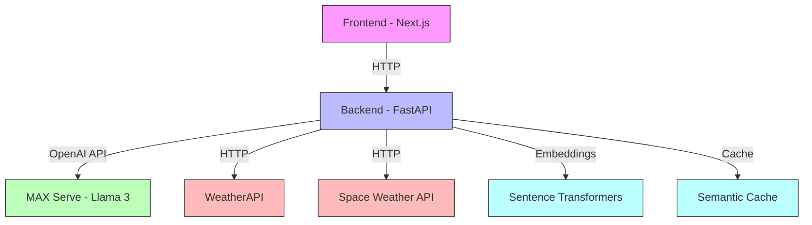
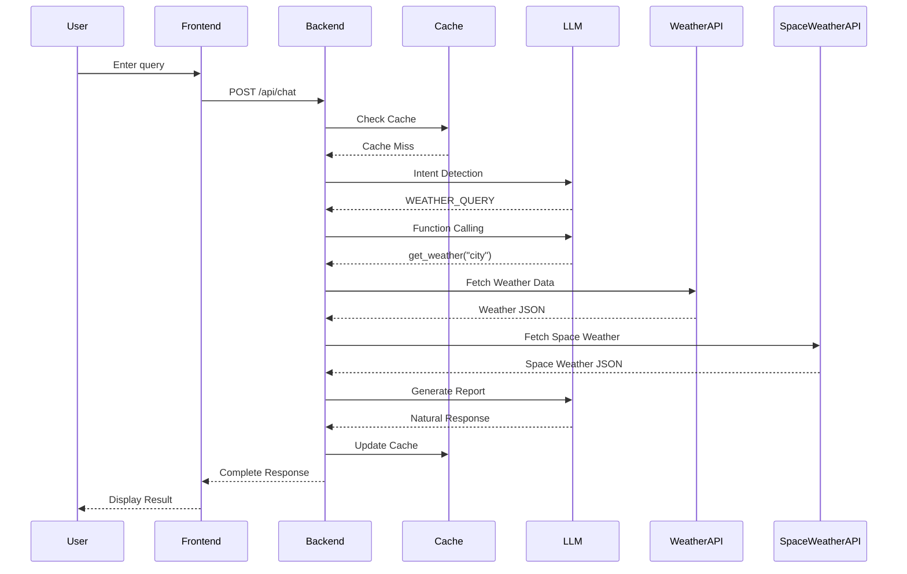

# Agentic Workflows: Build your own Weather Agent with MAX Serve, FastAPI and NextJS

This recipe demonstrates how to build an intelligent weather assistant that combines:

* LLM-powered intent detection and natural language understanding
* OpenAI-compatible function calling for structured data retrieval
* Efficient context management and response generation
* Modern React frontend with real-time updates
* Advanced performance optimizations and monitoring

We'll create a solution that showcases:

* MAX Serve capabilities with Llama 3
* Multi-stage LLM pipeline for natural interaction
* Function calling for external API integration
* Real-time frontend with Next.js and TypeScript
* Production-ready optimizations:
  * Connection pooling for efficient API calls
  * Semantic caching with embeddings
  * Operation time tracking and monitoring
  * Comprehensive error handling and resilience

You'll learn how to:

* Build a multi-stage LLM pipeline for intent classification and response generation
* Implement efficient data fetching with connection pooling and concurrent requests
* Use semantic caching to improve response times and reduce API calls
* Monitor and optimize performance with detailed operation timing
* Handle errors gracefully with automatic retries and fallbacks

## Requirements

Please make sure your system meets our [system requirements](https://docs.modular.com/max/get-started).

To proceed, ensure you have the `magic` CLI installed:

```bash
curl -ssL https://magic.modular.com/ | bash
```

or update it via:

```bash
magic self-update
```

You'll need:

* A valid [Hugging Face token](https://huggingface.co/settings/tokens) for accessing Llama 3
* A free API key from [WeatherAPI](https://www.weatherapi.com/) for weather data

Set up your environment variables:

```bash
cp backend/.env.sample backend/.env
echo "HUGGING_FACE_HUB_TOKEN=your_hf_token" >> backend/.env
echo "WEATHERAPI_API_KEY=your_api_key" >> backend/.env
```

## Quick start

1. Clone the repository:

```bash
git clone https://github.com/modular/max-recipes.git
cd max-recipes/ai-weather-agent
```

2. Run the application:

```bash
magic run app
```

3. Open [http://localhost:3000](http://localhost:3000) in your browser to see the UI


Then you can ask weather-related questions and get detailed reports.

## System architecture

The weather assistant uses a multi-tier architecture:



The architecture consists of several key components:

* **Frontend (Next.js)**: A modern React application providing real-time chat interface and weather visualization
* **Backend (FastAPI)**: Orchestrates the entire flow, handling request routing and response generation
* **MAX Serve**: Runs the Llama 3 model for intent detection, function calling, and response generation
* **WeatherAPI**: External service providing current weather conditions and forecasts
* **Sentence Transformers**: Used for generating embeddings for semantic caching
* **Semantic Cache**: Stores recent query results to improve response times

Each component is designed to be independently scalable and maintainable. The backend uses FastAPI's async capabilities to handle concurrent requests efficiently, while MAX Serve provides high-performance inference for the LLM components.

## Request flow

Here's how a typical weather query flows through the system:



This sequence represents a complete query lifecycle:

1. **Initial Request**: User enters a weather-related question in the chat interface
2. **Cache Check**: Backend first checks if a similar query exists in the semantic cache
3. **Intent Processing**:
    * LLM determines if the query is weather-related
    * If weather-related, function calling extracts the city name
4. **Data Gathering**:
    * Weather data is fetched from WeatherAPI
    * Multiple data sources are queried concurrently
5. **Response Generation**:
    * LLM generates a natural language response from the data
    * Response is cached for future similar queries
6. **Display**: Frontend renders both the text response and weather visualization

The entire process typically completes in 2-3 seconds, with cached responses returning in under 500ms.

## Technical deep dive

### Backend architecture

The backend implements a sophisticated multi-stage LLM pipeline that processes user queries through several key stages. Weather and space weather data are fetched concurrently for optimal performance:

```python
async def fetch_all_weather_data(city: str) -> dict:
    """Fetch both weather and space weather data concurrently"""
    weather_task = fetch_weather_data(city)
    space_weather_task = fetch_space_weather()

    results = await asyncio.gather(
        weather_task,
        space_weather_task
    )

    return {
        "weather": results[0],
        "space_weather": results[1]
    }
```

#### 1. Intent classification

The first stage determines whether the user is asking about weather or making general conversation:

```python
INTENT_PROMPT = """You are a comprehensive weather assistant. Your task is to:
1. First determine if the user is asking about:
   - Weather information (respond with exactly: "WEATHER_QUERY")
   - General chat (respond with exactly: "GENERAL_CHAT")
2. Only respond with one of these two options, nothing else.
"""

async def detect_intent(request_message: str, timing_collector: TimingCollector):
    """Detect if the user is asking about weather or just chatting"""
    response = await client.chat.completions.create(
        model="modularai/Llama-3.1-8B-Instruct-GGUF",
        messages=[
            {"role": "system", "content": INTENT_PROMPT},
            {"role": "user", "content": request_message},
        ],
        max_tokens=50,
        temperature=0,  # Use 0 for consistent outputs
    )
    return response
```

This stage ensures that weather-related queries are properly routed to the weather data pipeline while general queries receive appropriate chat responses.

#### 2. Function calling for data retrieval

When a weather query is detected, the backend uses OpenAI-compatible function calling to structure the request and fetch relevant data:

```python
TOOLS = [
    {
        "type": "function",
        "function": {
            "name": "get_weather",
            "description": "Get current weather and forecast data for a city",
            "parameters": {
                "type": "object",
                "properties": {
                    "city": {
                        "type": "string",
                        "description": "The city name to get weather for",
                    }
                },
                "required": ["city"],
            },
        },
    },
    {
        "type": "function",
        "function": {
            "name": "get_air_quality",
            "description": "Get air quality data for a city",
            "parameters": {
                "type": "object",
                "properties": {
                    "city": {"type": "string"},
                    "include_forecast": {"type": "boolean", "default": false}
                },
                "required": ["city"],
            },
        },
    }
]

async def handle_function_calling(message: str) -> dict:
    """Extract structured data requirements from natural language"""
    response = await client.chat.completions.create(
        model="modularai/Llama-3.1-8B-Instruct-GGUF",
        messages=[{"role": "user", "content": message}],
        tools=TOOLS,
        tool_choice="auto",
    )

    # Process tool calls and fetch data
    results = {}
    for tool_call in response.choices[0].message.tool_calls:
        func_name = tool_call.function.name
        arguments = json.loads(tool_call.function.arguments)

        if func_name == "get_weather":
            results["weather"] = await fetch_weather_data(arguments["city"])
        elif func_name == "get_air_quality":
            results["air_quality"] = await fetch_air_quality(arguments["city"])

    return results
```

#### 3. Natural language report generation

The final stage generates a natural language report from the collected weather data:

```python
WEATHER_ANALYSIS_PROMPT = """Given the user request about weather:
User: {user}

Analyze the following weather data and provide a natural, conversational summary:
Weather data: {weather_data}

Focus on:
1. Current conditions and how they feel
2. Notable patterns or changes in the forecast
3. Any relevant warnings or recommendations
"""

async def analyze_weather_data(request_message: str, weather_data: dict):
    """Generate a natural language report from weather data"""
    content = WEATHER_ANALYSIS_PROMPT.format(
        user=request_message,
        weather_data=str(weather_data)
    )
    response = await client.chat.completions.create(
        model="modularai/Llama-3.1-8B-Instruct-GGUF",
        messages=[{"role": "system", "content": content}],
        max_tokens=512,
        temperature=0.7,  # Slightly higher for more natural language
    )
    return response.choices[0].message.content
```

### Performance optimization and observability

The backend implements several advanced techniques to optimize performance and monitor system behavior:

#### 1. Connection pooling and HTTP optimization

The backend implements efficient HTTP connection pooling for external API calls:

```python
@asynccontextmanager
async def get_http_client():
    """Connection pooling: Shared http client for better connection reuse."""
    async with httpx.AsyncClient(
        timeout=httpx.Timeout(30.0, connect=10.0),
        limits=httpx.Limits(max_keepalive_connections=5),
    ) as client:
        yield client
```

This optimization provides:

* Connection reuse to reduce TCP handshake overhead
* Configurable connection pool size (5 keepalive connections)
* Separate timeouts for connection (10s) and operations (30s)
* Automatic connection lifecycle management through context manager

#### 2. Operation time tracking

A decorator-based timing system provides detailed performance metrics for each operation:

```python
class TimingCollector:
    def __init__(self):
        self._timings: List[Dict[str, Union[str, float]]] = []

    async def add_timing(self, operation: str, duration_ms: float):
        self._timings.append({
            "operation": operation,
            "duration_ms": duration_ms
        })

def track_operation_time(operation_name: str):
    def decorator(func):
        @wraps(func)
        async def wrapper(*args, **kwargs):
            timing_collector = kwargs.get('timing_collector')
            if not timing_collector:
                return await func(*args, **kwargs)

            start_time = time.time()
            try:
                return await func(*args, **kwargs)
            finally:
                duration = (time.time() - start_time) * 1000
                await timing_collector.add_timing(operation_name, duration)
        return wrapper
    return decorator
```

This system helps identify performance bottlenecks and track response times across different stages of the pipeline.

#### 3. Semantic caching

To reduce API calls and improve response times, the backend implements semantic caching using embeddings:

```python
class SemanticCache:
    def __init__(self, embedding_model: str = "sentence-transformers/all-mpnet-base-v2"):
        self.model = SentenceTransformer(embedding_model)
        self.cache = {}  # query_embedding -> (result, timestamp)
        self.ttl = 300  # 5 minutes cache TTL

    def _compute_embedding(self, query: str) -> np.ndarray:
        """Convert query to vector representation"""
        return self.model.encode(query, normalize_embeddings=True)

    def _find_similar(self, query_embedding: np.ndarray, threshold: float = 0.95) -> Optional[str]:
        """Find semantically similar cached queries"""
        for cached_embedding in self.cache:
            similarity = np.dot(query_embedding, cached_embedding)
            if similarity > threshold:
                return cached_embedding
        return None

    async def get(self, query: str) -> Optional[dict]:
        """Retrieve cached result for semantically similar query"""
        query_embedding = self._compute_embedding(query)
        similar_query = self._find_similar(query_embedding)

        if similar_query:
            result, timestamp = self.cache[similar_query]
            if time.time() - timestamp < self.ttl:
                return result
        return None
```

This semantic cache is particularly useful for:

* Handling variations of similar questions (e.g., "weather in London" vs "London weather")
* Reducing API calls to external weather services
* Improving response times for frequent queries

### Error handling and resilience

The backend implements comprehensive error handling:

```python
@app.exception_handler(HTTPException)
async def http_exception_handler(request, exc):
    return JSONResponse(
        status_code=exc.status_code,
        content={"detail": str(exc.detail)}
    )

@app.exception_handler(Exception)
async def general_exception_handler(request, exc):
    logger.exception("Unexpected error")
    return JSONResponse(
        status_code=500,
        content={"detail": "An unexpected error occurred"}
    )

def wait_for_llm_server(base_url: str):
    """Ensure LLM server is healthy before starting"""
    @retry(
        stop=stop_after_attempt(20),
        wait=wait_fixed(60),
        retry=(
            retry_if_exception_type(httpx.RequestError) |
            retry_if_result(lambda x: x.status_code != 200)
        )
    )
    async def _check_health():
        async with httpx.AsyncClient() as client:
            return await client.get(f"{base_url}/health")
    return _check_health()
```

The system includes several resilience features:

* Automatic retries for transient failures
* Graceful degradation when services are unavailable
* Comprehensive error logging and monitoring
* Rate limiting for external API calls

### Frontend implementation

The frontend is built with Next.js 14 and TypeScript, featuring three main components:

#### 1. Chat interface

```typescript
interface ChatMessage {
    role: 'user' | 'assistant';
    content: string;
    data?: WeatherData;
    timings?: Array<{
        operation: string;
        duration_ms: number;
    }>;
}

export default function Chat() {
    const [messages, setMessages] = useState<ChatMessage[]>([]);
    const [isLoading, setIsLoading] = useState(false);
}
```

#### 2. Weather data visualization

```typescript
interface WeatherData {
    weather: {
        location: {
            name: string;
            country: string;
            localtime: string;
        };
        current: {
            temperature: number;
            condition: string;
            feels_like: number;
            humidity: number;
            wind_kph: number;
        };
        forecast: Array<{
            date: string;
            max_temp: number;
            min_temp: number;
            condition: string;
        }>;
    };
    air_quality?: {
        aqi: number;
        pm2_5: number;
    };
}
```

#### 3. Performance monitoring

```typescript
interface OperationTiming {
    operation: string;
    duration_ms: number;
}

const operationLabels: Record<string, string> = {
    'intent_detection': 'Analyzing question',
    'weather_data_fetch': 'Getting weather data',
    'weather_analysis': 'Creating weather report'
};
```

## Troubleshooting

Common issues and solutions:

1. **LLM server connection issues**
   * Ensure MAX Serve is running (`magic run app`)
   * Check logs for any GPU-related errors
   * Verify Hugging Face token is set correctly

2. **Weather API Problems**
   * Verify API key in `.env`
   * Check rate limits on free tier
   * Ensure city names are valid

3. **Frontend Development**
   * Clear `.next` cache if builds fail
   * Run `npm install` after pulling updates
   * Check browser console for errors

4. **Performance Issues**
   * Monitor GPU memory usage
   * Adjust batch sizes if needed
   * Check semantic cache hit rates

## Customizing for your domain

This recipe demonstrates patterns that can be applied to many domains beyond weather reporting:

### Adapting the pipeline

* Replace WeatherAPI with your domain's data source (e.g., financial data, product catalogs, medical records)
* Modify function definitions to match your data schema
* Adjust prompts for domain-specific report generation

### Reusable components

The following components can be directly reused:

* Intent classification system for routing queries
* Semantic caching for similar questions in your domain
* Connection pooling for any external API calls
* Performance monitoring and error handling infrastructure

### Example adaptations

1. **Financial Reports**
   * Replace weather data with market data
   * Adapt function calling for stock symbols
   * Generate natural language market analysis

2. **Product Recommendations**
   * Use product catalog as data source
   * Modify functions for product queries
   * Generate personalized recommendations

3. **Medical Summaries**
   * Connect to health record systems
   * Add functions for patient data retrieval
   * Generate patient friendly health reports

The multi-stage LLM pipeline pattern, combined with efficient data handling and caching, provides a robust foundation for building various domain-specific AI assistants.

## Conclusion

This recipe demonstrates how to build a production-ready AI assistant that combines:

* Efficient multi-stage LLM pipelines for natural language understanding and generation
* Advanced performance optimizations like semantic caching and connection pooling
* Robust error handling and monitoring capabilities
* Modern frontend with real-time updates and performance tracking

The patterns and components shown here provide a solid foundation for building your own domain-specific AI assistants. Whether you're working with financial data, medical records, or product catalogs, the architecture can be adapted while maintaining performance, reliability, and user experience.

## Next steps

Now that you've built a foundation for AI-powered applications, you can explore more advanced deployments and features:

* Explore [MAX documentation](https://docs.modular.com/max/) for more features
* Deploy MAX Serve on [AWS, GCP or Azure](https://docs.modular.com/max/tutorials/max-serve-local-to-cloud/)
* Join our [Modular Forum](https://forum.modular.com/) and [Discord community](https://discord.gg/modular)

We're excited to see what you'll build with MAX! Share your projects with us using `#ModularAI` on social media.
