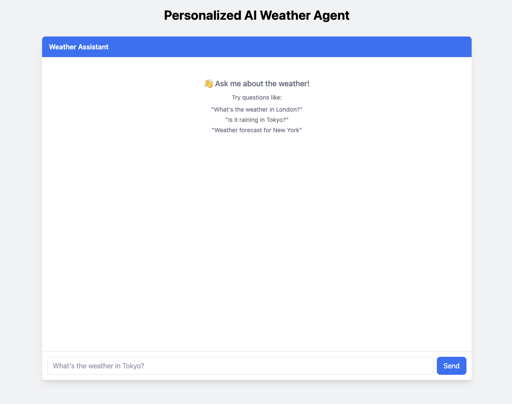
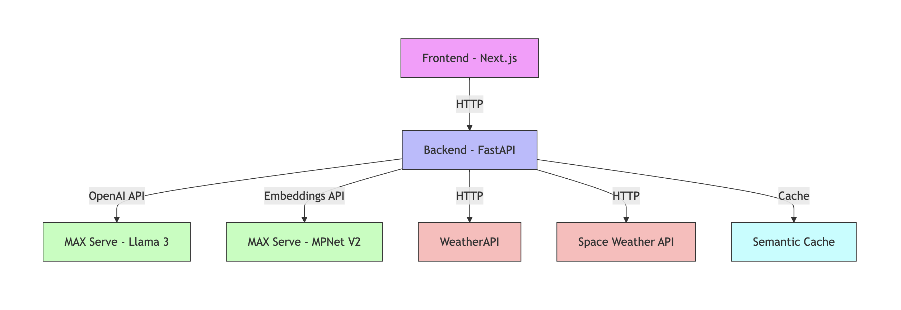
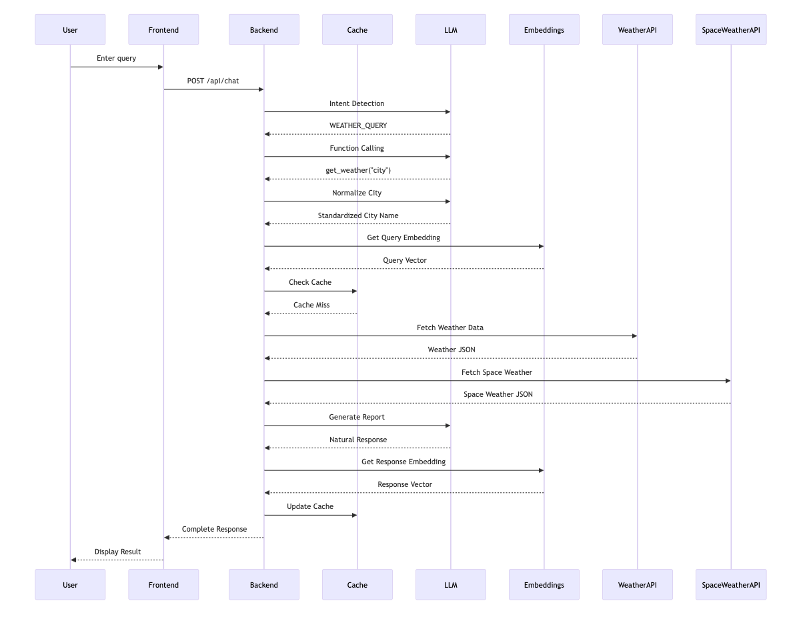

# Agentic Workflows: Build your own Weather Agent with MAX Serve, FastAPI and NextJS

This recipe demonstrates how to build an intelligent weather assistant that combines:

* LLM-powered intent detection and natural language understanding
* OpenAI-compatible function calling for structured data retrieval
* Efficient context management and response generation
* Modern React frontend with real-time updates
* Advanced performance optimizations and monitoring

While this recipe focuses on weather data, the **patterns** demonstrated here can be adapted for various reporting and automation needs, such as:

* **Financial reporting and market analysis**
* **Product recommendations and catalog queries**
* **Medical record summaries and health reports**
* **Customer service automation**
* **Real estate property analysis**
* And many other domain-specific applications

We'll create a solution that showcases:

* MAX Serve capabilities with Llama 3
* Multi-stage LLM pipeline for natural interaction
* Function calling for external API integration
* Real-time frontend with Next.js and TypeScript
* Production-pattern optimizations:
  * Connection pooling for efficient API calls
  * Semantic caching with embeddings
  * Operation time tracking and monitoring
  * Comprehensive error handling and resilience

You'll learn how to:

* Build a multi-stage LLM pipeline for intent classification and response generation
* Implement efficient data fetching with connection pooling and concurrent requests
* Use semantic caching to improve response times and reduce API calls
* Monitor and optimize performance with detailed operation timing
* Handle errors gracefully with automatic retries and fallbacks

## Requirements

Please make sure your system meets our [system requirements](https://docs.modular.com/max/get-started).

To proceed, ensure you have the `magic` CLI installed with the `magic --version` to be **0.7.2** or newer:

```bash
curl -ssL https://magic.modular.com/ | bash
```

or update it via:

```bash
magic self-update
```

You'll need:

* A valid [Hugging Face token](https://huggingface.co/settings/tokens) for accessing Llama 3
* A free API key from [WeatherAPI](https://www.weatherapi.com/) for weather data

Set up your environment variables:

```bash
cp backend/.env.sample backend/.env
echo "HUGGING_FACE_HUB_TOKEN=your_hf_token" > backend/.env
echo "WEATHERAPI_API_KEY=your_api_key" >> backend/.env
```

## Quick start

1. Download the code for this recipe using `magic` CLI:

    ```bash
    magic init ai-weather-agent --from modular/max-recipes/ai-weather-agent
    cd ai-weather-agent
    ```

2. Run the application:

    **Make sure the ports `7999, 8001` and `8010` are available. You can adjust the port settings in [Procfile](./Procfile).**

    ```bash
    magic run app
    ```

    Note that it may take a few minutes for models to be downloaded and compiled.

3. Open [http://localhost:3000](http://localhost:3000) in your browser to see the UI when **all services** below are ready:

   * MAX Serve embedding on port `7999`
   * MAX Serve Llama 3 on port `8000` and
   * Backend FastAPI on port `8001`

    

    Then you can ask weather-related questions and get detailed reports.

    **Actions to take**:

   * Go ahead and send a chat request with `Hi`.
   * Then proceed with a city name like `Vancouver`. Notice that the app understands it's a city name and provides a weather report.
   * Check the observability for each involved step in the UI.
   * Try entering "yvr" and notice that the report is generated much faster this time. Keep reading to understand the optimizations such as semantic-cache.
   * Try with more queries and check the results

4. And once done with the app, to clean up the resources run:

    ```bash
    magic run clean
    ```

## System architecture

The weather assistant uses a multi-tier architecture:



The architecture consists of several key components:

* **Frontend (Next.js)**: A modern React application providing real-time chat interface and weather visualization
* **Backend (FastAPI)**: Orchestrates the entire flow, handling request routing and response generation
* **MAX Serve**: Runs the Llama 3 model for intent detection, function calling, and response generation
* **WeatherAPI**: External service providing current weather conditions and forecasts
* **Sentence Transformers**: Used `sentence-transformers/all-mpnet-base-v2` for generating embeddings for semantic caching
* **Semantic Cache**: Stores recent query results to improve response times

Each component is designed to be independently scalable and maintainable. The backend uses FastAPI's async capabilities to handle concurrent requests efficiently, while MAX Serve provides high-performance inference for the LLM components.

## Request flow

Here's how a typical weather query flows through the system:



This sequence represents a complete query lifecycle:

1. **Initial request**: User enters a weather-related question in the chat interface
2. **Cache check**: Backend first checks if a similar query exists in the semantic cache
3. **Intent processing**:
    * LLM determines if the query is weather-related
    * If weather-related, function calling extracts the city name
4. **City normalization**:
    * LLM standardizes city names (e.g., "NYC" → "New York City")
    * Handles variations and abbreviations consistently
5. **Data gathering**:
    * Weather data is fetched from WeatherAPI
    * Multiple data sources are queried concurrently
6. **Response generation**:
    * LLM generates a natural language response from the data
    * Response is cached for future similar queries
7. **Display**: Frontend renders both the text response and weather visualization

The entire process typically completes in 2-3 seconds, with cached responses returning in under 500ms.

## Technical deep dive

### Backend architecture

The backend implements a sophisticated multi-stage LLM pipeline that processes user queries through several key stages. Weather and space weather data are fetched concurrently for optimal performance:

```python
async def fetch_all_weather_data(city: str) -> dict:
    """Fetch both weather and space weather data concurrently"""
    weather_task = fetch_weather_data(city)
    space_weather_task = fetch_space_weather()

    results = await asyncio.gather(
        weather_task,
        space_weather_task
    )

    return {
        "weather": results[0],
        "space_weather": results[1]
    }
```

#### 1. Intent classification

The first stage determines whether the user is asking about weather or making general conversation:

```python
# Example queries and their classifications:
# "What's the weather like in London?" -> "WEATHER_QUERY"
# "How are you doing today?" -> "GENERAL_CHAT"
# "Will it rain in Paris tomorrow?" -> "WEATHER_QUERY"
# "Tell me a joke" -> "GENERAL_CHAT"

@track_operation_time("intent_detection")
async def detect_intent(request_message: str, timing_collector: TimingCollector):
    """Detect if the user is asking about weather or just chatting"""
    response = await llm_client.chat.completions.create(
        model="modularai/Llama-3.1-8B-Instruct-GGUF",
        messages=[
            {"role": "system", "content": INTENT_PROMPT},
            {"role": "user", "content": request_message},
        ],
        temperature=0,  # Use 0 for deterministic outputs
    )
    return response.choices[0].message.content.strip()
```

The intent classifier uses temperature=0 for consistent outputs and is wrapped with timing tracking for performance monitoring.

#### 2. City name normalization

After detecting weather-related intent, the backend normalizes city names using the LLM to handle variations and abbreviations:

```python
CITY_NORMALIZATION_PROMPT = """Normalize the following city name to its standard form.
Examples:
- "NYC" -> "New York City"
- "SF" -> "San Francisco"
- "LA" -> "Los Angeles"

City: {city}

Respond with only the normalized city name, nothing else."""

async def normalize_city_name(city: str, timing_collector: TimingCollector) -> str:
    """Standardize city names for consistent API calls and caching"""
    response = await llm_client.chat.completions.create(
        model="modularai/Llama-3.1-8B-Instruct-GGUF",
        messages=[
            {"role": "system", "content": CITY_NORMALIZATION_PROMPT.format(city=city)},
        ],
        max_tokens=50,
        temperature=0,  # Use 0 for consistent outputs
    )
    return response.choices[0].message.content.strip()
```

This normalization ensures:

* Consistent API calls for different variations of city names
* Better cache utilization by standardizing queries
* Improved user experience with flexible input handling

#### 3. Function calling for data retrieval

When a weather query is detected, the backend uses OpenAI-compatible function calling to structure the request and fetch relevant data:

```python
TOOLS = [
    {
        "type": "function",
        "function": {
            "name": "get_weather",
            "description": "Get current weather and forecast data for a city",
            "parameters": {
                "type": "object",
                "properties": {
                    "city": {
                        "type": "string",
                        "description": "The city name to get weather for",
                    }
                },
                "required": ["city"],
            },
        },
    },
    {
        "type": "function",
        "function": {
            "name": "get_air_quality",
            "description": "Get air quality data for a city",
            "parameters": {
                "type": "object",
                "properties": {
                    "city": {"type": "string"},
                    "include_forecast": {"type": "boolean", "default": false}
                },
                "required": ["city"],
            },
        },
    }
]

async def handle_function_calling(message: str) -> dict:
    """Extract structured data requirements from natural language"""
    response = await llm_client.chat.completions.create(
        model="modularai/Llama-3.1-8B-Instruct-GGUF",
        messages=[{"role": "user", "content": message}],
        tools=TOOLS,
        tool_choice="auto",
    )

    # Process tool calls and fetch data
    results = {}
    for tool_call in response.choices[0].message.tool_calls:
        func_name = tool_call.function.name
        arguments = json.loads(tool_call.function.arguments)

        if func_name == "get_weather":
            results["weather"] = await fetch_weather_data(arguments["city"])
        elif func_name == "get_air_quality":
            results["air_quality"] = await fetch_air_quality(arguments["city"])

    return results
```

#### 3. Natural language report generation

The final stage generates a natural language report from the collected weather data:

```python
WEATHER_ANALYSIS_PROMPT = """Given the user request about weather:
User: {user}

Analyze the following weather data and provide a natural, conversational summary:
Weather data: {weather_data}

Focus on:
1. Current conditions and how they feel
2. Notable patterns or changes in the forecast
3. Any relevant warnings or recommendations
"""

async def analyze_weather_data(request_message: str, weather_data: dict):
    """Generate a natural language report from weather data"""
    content = WEATHER_ANALYSIS_PROMPT.format(
        user=request_message,
        weather_data=str(weather_data)
    )
    response = await llm_client.chat.completions.create(
        model="modularai/Llama-3.1-8B-Instruct-GGUF",
        messages=[{"role": "system", "content": content}],
        max_tokens=512,
        temperature=0.7,  # Slightly higher for more natural language
    )
    return response.choices[0].message.content
```

### Performance optimization and observability

The backend implements several advanced techniques to optimize performance and monitor system behavior:

#### 1. Connection pooling and HTTP optimization

The backend implements efficient HTTP connection pooling for external API calls:

```python
@asynccontextmanager
async def get_http_client():
    """Connection pooling: Shared http client for better connection reuse."""
    async with httpx.AsyncClient(
        timeout=httpx.Timeout(30.0, connect=10.0),
        limits=httpx.Limits(max_keepalive_connections=5),
    ) as client:
        yield client
```

This optimization provides:

* Connection reuse to reduce TCP handshake overhead
* Configurable connection pool size (5 keepalive connections)
* Separate timeouts for connection (10s) and operations (30s)
* Automatic connection lifecycle management through context manager

#### 2. Operation time tracking

The backend uses asyncio locks and precise timing for operation tracking:

```python
class TimingCollector:
    def __init__(self, lock: asyncio.Lock = None):
        self._timings: List[Dict[str, Union[str, float]]] = []
        self._lock = lock or asyncio.Lock()

    async def add_timing(self, operation: str, duration_ms: float):
        async with self._lock:
            self._timings.append({
                "operation": operation,
                "duration_ms": duration_ms
            })

async def get_timings(self) -> List[Dict[str, Union[str, float]]]:
    async with self._lock:
        return self._timings.copy()
```

This system helps:

* Safely track concurrent operations with asyncio locks
* Provide accurate timing for each pipeline stage
* Enable real-time performance monitoring in the UI

#### 3. Semantic caching

To reduce API calls and improve response times, the backend implements semantic caching using embeddings:

```python
class SemanticCache:
    def __init__(self, threshold=0.75, ttl_seconds=CACHE_TTL):
        self.threshold = threshold
        self.ttl_seconds = ttl_seconds
        self.cache: Dict[Tuple[float, ...], Tuple[Any, datetime]] = {}
        self._lock = Lock()

    async def _compute_embedding(self, text: str) -> np.ndarray:
        """Get embeddings from MAX Serve embedding endpoint"""
        response = await embedding_client.embeddings.create(
            model=EMBEDDING_MODEL,
            input=text
        )
        embedding = np.array(response.data[0].embedding)
        return embedding

    def _cosine_similarity(self, a: np.ndarray, b: np.ndarray) -> float:
        """Calculate cosine similarity between two vectors"""
        return np.dot(a, b) / (np.linalg.norm(a) * np.linalg.norm(b))

    async def get(self, text: str, normalized_city: str = None) -> Tuple[bool, Any]:
        """Try to find a semantically similar cached result"""
        async with self._lock:
            now = datetime.now()
            # Clean expired entries
            expired = []
            for embedding_tuple, (value, timestamp) in self.cache.items():
                if (now - timestamp).total_seconds() > self.ttl_seconds:
                    expired.append(embedding_tuple)
            for emb in expired:
                del self.cache[emb]

            # Use normalized city if provided, otherwise use original text
            query_text = normalized_city if normalized_city else text
            query_embedding = await self._compute_embedding(query_text)
            query_tuple = tuple(query_embedding.tolist())

            # Find most similar cached query
            max_similarity = 0
            best_match = None

            for cached_embedding_tuple, (value, _) in self.cache.items():
                cached_embedding = np.array(cached_embedding_tuple)
                similarity = self._cosine_similarity(query_embedding, cached_embedding)
                if similarity > max_similarity:
                    max_similarity = similarity
                    best_match = value

            if max_similarity > self.threshold:
                return True, best_match
            return False, None

# Example cache decorator usage
@semantic_cache(threshold=0.90, ttl_seconds=CACHE_TTL)
@track_operation_time("chat_response")
async def generate_chat_response(request_message: str, timing_collector: TimingCollector):
    """Generate a general chat response with caching"""
    response = await llm_client.chat.completions.create(
        model="modularai/Llama-3.1-8B-Instruct-GGUF",
        messages=[
            {
                "role": "system",
                "content": "You are a friendly weather assistant. Provide helpful and concise responses.",
            },
            {"role": "user", "content": request_message},
        ],
        max_tokens=256,
        temperature=0,
    )
    return response.choices[0].message.content
```

The semantic cache provides several key features:

* Thread-safe operations with asyncio locks
* Automatic cleanup of expired entries
* Configurable similarity threshold
* Support for normalized city names
* Integration with timing collection

Example similar queries that would hit the cache:

* "What's the weather in NYC?" ↔ "Tell me the weather in New York City"
* "Is it raining in London?" ↔ "What's the precipitation in London?"
* "Temperature in Paris" ↔ "How hot is it in Paris?"

### Error handling and resilience

The backend implements comprehensive error handling:

```python
@app.exception_handler(HTTPException)
async def http_exception_handler(request, exc):
    return JSONResponse(
        status_code=exc.status_code,
        content={"detail": str(exc.detail)}
    )

@app.exception_handler(Exception)
async def general_exception_handler(request, exc):
    logger.exception("Unexpected error")
    return JSONResponse(
        status_code=500,
        content={"detail": "An unexpected error occurred"}
    )

def wait_for_llm_server(base_url: str):
    """Ensure LLM server is healthy before starting"""
    @retry(
        stop=stop_after_attempt(20),
        wait=wait_fixed(60),
        retry=(
            retry_if_exception_type(httpx.RequestError) |
            retry_if_result(lambda x: x.status_code != 200)
        )
    )
    async def _check_health():
        async with httpx.AsyncClient() as client:
            return await client.get(f"{base_url}/health")
    return _check_health()
```

The system includes features such as:

* Graceful degradation when services are unavailable
* Error logging and monitoring

### Frontend implementation

The frontend is built with Next.js 14 and TypeScript, featuring three main components:

#### 1. Chat interface

```typescript
interface ChatMessage {
    role: 'user' | 'assistant';
    content: string;
    data?: WeatherData;
    timings?: Array<{
        operation: string;
        duration_ms: number;
    }>;
}

export default function Chat() {
    const [messages, setMessages] = useState<ChatMessage[]>([]);
    const [isLoading, setIsLoading] = useState(false);
}
```

#### 2. Weather data visualization

```typescript
interface WeatherData {
    weather: {
        location: {
            name: string;
            country: string;
            localtime: string;
        };
        current: {
            temperature: number;
            condition: string;
            feels_like: number;
            humidity: number;
            wind_kph: number;
        };
        forecast: Array<{
            date: string;
            max_temp: number;
            min_temp: number;
            condition: string;
        }>;
    };
    air_quality?: {
        aqi: number;
        pm2_5: number;
    };
}
```

#### 3. Performance monitoring

```typescript
interface OperationTiming {
    operation: string;
    duration_ms: number;
}

const operationLabels: Record<string, string> = {
    'intent_detection': 'Analyzing question',
    'weather_data_fetch': 'Getting weather data',
    'weather_analysis': 'Creating weather report'
};
```

## Troubleshooting

Common issues and solutions:

1. **LLM server connection issues**
   * Ensure MAX Serve is running (`magic run app`)
   * Check logs for any GPU-related errors
   * Verify Hugging Face token is set correctly

2. **Weather API Problems**
   * Verify API key in `.env`
   * Check rate limits on free tier
   * Ensure city names are valid

3. **Frontend Development**
   * Clear `.next` cache if builds fail
   * Run `npm install` after pulling updates
   * Check browser console for errors

4. **Performance Issues**
   * Monitor GPU memory usage
   * Adjust batch sizes if needed
   * Check semantic cache hit rates

## Customizing for your domain

This recipe demonstrates patterns that can be applied to many domains beyond weather reporting:

### Adapting the pipeline

* Replace WeatherAPI with your domain's data source (e.g., financial data, product catalogs, medical records)
* Modify function definitions to match your data schema
* Adjust prompts for domain-specific report generation

### Reusable components

The following components can be directly reused:

* Intent classification system for routing queries
* Semantic caching for similar questions in your domain
* Connection pooling for any external API calls
* Performance monitoring and error handling infrastructure

### Example adaptations

1. **Financial reports**
   * Replace weather data with market data
   * Adapt function calling for stock symbols
   * Generate natural language market analysis

2. **Product recommendations**
   * Use product catalog as data source
   * Modify functions for product queries
   * Generate personalized recommendations

3. **Medical summaries**
   * Connect to health record systems
   * Add functions for patient data retrieval
   * Generate patient friendly health reports

The multi-stage LLM pipeline pattern, combined with efficient data handling and caching, provides a robust foundation for building various domain-specific AI assistants.

## Conclusion

This recipe demonstrates how to build a production-ready AI assistant that combines:

* Efficient multi-stage LLM pipelines for natural language understanding and generation
* Advanced performance optimizations like semantic caching and connection pooling
* Robust error handling and monitoring capabilities
* Modern frontend with real-time updates and performance tracking

The patterns and components shown here provide a solid foundation for building your own domain-specific AI assistants. Whether you're working with financial data, medical records, or product catalogs, the architecture can be adapted while maintaining performance, reliability, and user experience.

## Next steps

Now that you've built a foundation for AI-powered applications, you can explore more advanced deployments and features:

* Explore [MAX documentation](https://docs.modular.com/max/) for more features
* Deploy MAX Serve on [AWS, GCP or Azure](https://docs.modular.com/max/tutorials/max-serve-local-to-cloud/)
* Join our [Modular Forum](https://forum.modular.com/) and [Discord community](https://discord.gg/modular)

We're excited to see what you'll build with MAX! Share your projects with us using `#ModularAI` on social media.
