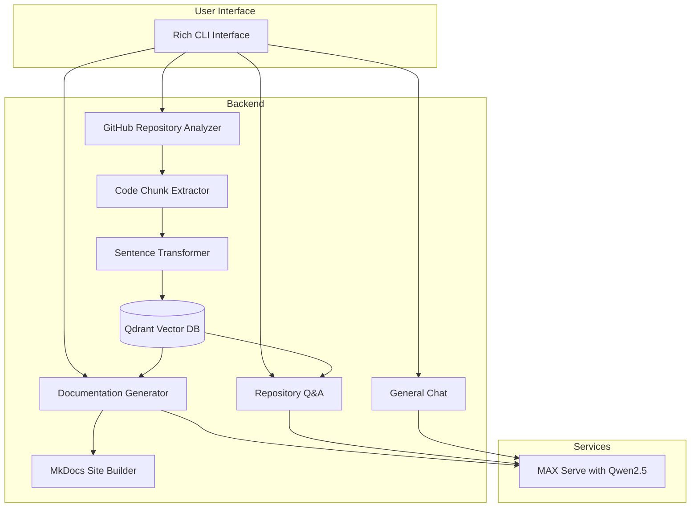
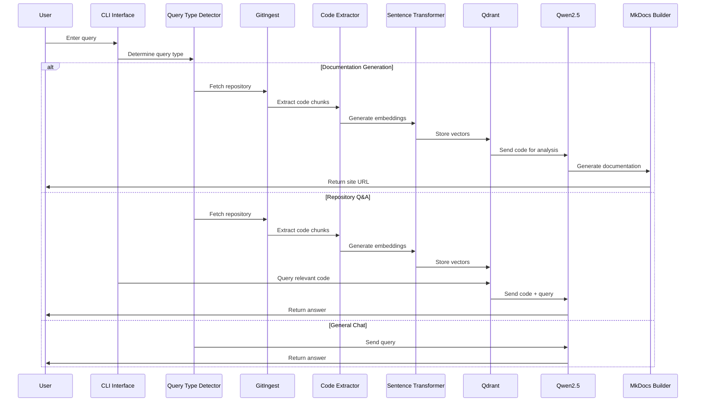

# Learn How to Build a GitHub Chat and Auto-Doc Agent with Qwen2.5 and MAX Serve

This recipe demonstrates how to build a powerful GitHub repository assistant that combines:

* [Qwen2.5-7B-Instruct-1M](https://huggingface.co/Qwen/Qwen2.5-7B-Instruct-1M) for intelligent code analysis and documentation generation
* [gitingest](https://github.com/gitingest/gitingest) for efficient GitHub repository analysis
* [Qdrant](https://qdrant.tech/) for vector storage and semantic search
* [sentence-transformers](https://www.sbert.net/) for code embedding generation
* [MkDocs](https://www.mkdocs.org/) with Material theme for beautiful documentation sites
* [MAX Serve](https://docs.modular.com/max/serve/) for efficient model serving

The agent provides three main capabilities:

1. **Repository-aware Q&A** for answering questions about specific codebases
2. **Automatic documentation generation** for Python and Mojo repositories
3. **General programming chat** for development assistance

While this recipe focuses on Python code, the patterns demonstrated here can be adapted for various needs like:

* **API documentation generation**
* **Code explanation and tutorials**
* **Technical specification creation**
* **Knowledge base construction**
* **Educational content development**

## Requirements

Please make sure your system meets our [system requirements](https://docs.modular.com/max/get-started).

### Important: GPU requirements

This recipe requires a GPU with CUDA 12.5 support. Recommended GPUs:

* NVIDIA H100 / H200, A100, A40, L40

To proceed, ensure you have the `magic` CLI installed with the `magic --version` to be **0.7.2** or newer:

```bash
curl -ssL https://magic.modular.com/ | bash
```

or update it via:

```bash
magic self-update
```

## Quick start

1. Download the code for this recipe using `magic` CLI:

    ```bash
    magic init autodoc-repo-chat-agent --from modular/max-recipes/autodoc-repo-chat-agent
    cd autodoc-repo-chat-agent
    ```

2. Start the LLM server:

    **Make sure the port `8010` is available. You can adjust the port settings in [pyproject.toml](./pyproject.toml).**

    ```bash
    magic run server
    ```

3. In a new terminal, run the agent:

    ```bash
    magic run agent
    ```

4. When prompted, you can:
   * Ask questions about a specific repository
   * Include URL of a GitHub repository and start asking questions about it
   * Ask to generate documentation for a Python GitHub repository (larger code bases are more time consuming)

5. To clean up generated files:

```bash
magic run clean
```

## System architecture



The architecture consists of several key components:

1. **User Interface**: Rich CLI for interaction
2. **Repository Analysis**:
   * GitHub repository ingestion
   * Code chunk extraction
   * Embedding generation
3. **Query Handling**:
   * Documentation generation
   * Repository-aware Q&A
   * General programming chat
4. **LLM Integration**:
   * MAX Serve with Qwen2.5
   * Context-aware prompting
   * Response formatting

## Request flow

Here's how a typical request flows through the system:



## Technical deep dive

### Main application flow

The main entry point orchestrates the different handlers and manages the conversation flow:

```python
async def main():
    """Main entry point for the application."""
    console = Console()
    client = AsyncOpenAI(base_url=LLM_SERVER, api_key=LLM_API_KEY)

    handlers = {
        QueryType.CHAT: ChatHandler(client, console),
        QueryType.DOC_GEN: DocGenHandler(client, console),
        QueryType.REPO_QA: RepoQAHandler(client, console)
    }

    console.print(Panel(
        "[bold blue]Welcome to GitHub Repo Helper[/bold blue]\n\n"
        "I can help you with:\n"
        "- [green]Generating documentation[/green] for GitHub repositories\n"
        "- [green]Answering questions[/green] about repository code\n"
        "- [green]General questions[/green] about programming and development\n\n"
        "Type your query or 'quit' to exit",
        title="🤖 GitHub Repo Helper",
        border_style="blue",
        expand=False
    ))

    # Global conversation history
    conversation_history = []
    # Track the current handler type to maintain context
    current_handler_type = None
    # Track the current repo URL
    current_repo_url = None

    while True:
        console.print("[bold cyan]You:[/bold cyan] ", end="")
        query = input()

        if query.lower() in ['quit', 'exit', 'bye']:
            console.print("[bold blue]Thanks for using GitHub Repo Helper. Goodbye![/bold blue]")
            break

        # Add user query to global conversation history
        conversation_history.append({"role": "user", "content": query})

        query_type, repo_url = await determine_query_type(query, client)
        context = QueryContext(query=query, repo_url=repo_url)

        # Handle the query with the appropriate handler
        handler = handlers[query_type]
        result = await handler.handle(context)

        # Update global conversation history with the assistant's response
        conversation_history.append({"role": "assistant", "content": result})
```

Key features:

* Rich console interface with colorful formatting
* Conversation history management across handlers
* Query type detection and routing
* Context preservation between interactions

### Query type detection

The system automatically determines the type of query to route it to the appropriate handler:

```python
async def determine_query_type(query: str, client: AsyncOpenAI) -> Tuple[QueryType, Optional[str]]:
    """Determine the type of query and extract GitHub repository URL if present."""
    # Check for GitHub URL in the query
    github_url_match = re.search(r'https?://github\.com/[a-zA-Z0-9_-]+/[a-zA-Z0-9_-]+', query)
    github_url = github_url_match.group(0) if github_url_match else None

    # Simple heuristics for query classification
    if re.search(r'(generate|create|build|make)\s+(docs|documentation)', query.lower()):
        return QueryType.DOC_GEN, github_url

    if github_url or re.search(r'(repo|repository|codebase)', query.lower()):
        return QueryType.REPO_QA, github_url

    return QueryType.CHAT, None
```

Key features:

* URL extraction with regex
* Keyword-based classification
* Default fallback to general chat

### Repository Q&A

The system provides context-aware answers to questions about repositories:

```python
class RepoQAHandler(BaseHandler):
    async def handle(self, context: QueryContext):
        """Handle repository Q&A with context and conversation history."""
        # Process repository if needed
        if context.repo_url and not context.repo_content:
            with self.console.status("[bold green]Processing repository...", spinner="dots"):
                summary, tree, raw_content = await ingest_async(context.repo_url)
                context.repo_content = self._process_raw_content(raw_content)

                # Parse code and generate embeddings
                await code_parse(context.repo_content, self.collection_name, console=self.console)
                self.embeddings_created = True

        # Perform semantic search to find relevant code chunks
        relevant_chunks = []
        if context.repo_content and self.embeddings_created:
            query_embedding = get_embedding_model().encode(context.query)

            # Search for relevant code chunks
            search_results = self.qdrant_client.search(
                collection_name=self.collection_name,
                query_vector=query_embedding.tolist(),
                limit=5
            )

            # Get the actual chunks from search results
            for result in search_results:
                chunk_id = result.id
                chunk = self.chunk_cache.get(chunk_id)
                if chunk:
                    relevant_chunks.append(chunk)

        # Generate response with context
        system_prompt = f"""You are a helpful assistant that answers questions about code repositories.
Current repository: {context.repo_url or 'Unknown'}
Use the provided code context to answer questions accurately.
If you don't know the answer, say so rather than making something up."""

        # Prepare context from relevant chunks
        context_text = ""
        if relevant_chunks:
            context_text = "Here are code snippets that might help answer the question:\n\n"
            for i, chunk in enumerate(relevant_chunks):
                context_text += f"Snippet {i+1} from {chunk.file_path}:\n```{chunk.metadata.get('language', 'python')}\n{chunk.content}\n```\n\n"

        # Generate response
        response = await self.client.chat.completions.create(
            model=LLM_MODEL,
            messages=[
                {"role": "system", "content": system_prompt},
                {"role": "user", "content": f"{context_text}\nQuestion: {context.query}"}
            ]
        )

        return response.choices[0].message.content
```

Features:

* Repository content caching
* Semantic search for relevant code
* Context-aware prompting
* Conversation history tracking

### Code extraction and analysis

The system uses gitingest to analyze repositories and extract meaningful code chunks:

```python
async def extract_code_chunks(repo_content, language='python'):
    """Extract meaningful code chunks from repository content."""
    chunks = []
    config = LANGUAGE_CONFIGS.get(language, LANGUAGE_CONFIGS['python'])

    for file_path, content in repo_content.items():
        if not any(file_path.endswith(ext) for ext in config['extensions']):
            continue

        for chunk_type, pattern in config['patterns'].items():
            for match in re.finditer(pattern, content, re.DOTALL):
                chunk_content = match.group(0)

                # Extract name using the language-specific pattern
                name_match = re.search(config['name_pattern'], chunk_content)
                name = name_match.group(2) if name_match else "Unknown"

                chunks.append(CodeChunk(
                    content=chunk_content,
                    start_line=content[:match.start()].count('\n') + 1,
                    end_line=content[:match.end()].count('\n') + 1,
                    file_path=file_path,
                    chunk_type=chunk_type,
                    metadata={
                        'language': language,
                        'name': name
                    }
                ))

    return chunks
```

Key features:

* Language-specific pattern matching
* Intelligent chunk extraction
* Metadata collection for context

### Documentation generation

The LLM generates documentation based on code analysis:

```python
async def generate_documentation(chunk, prompt, doc_type, client):
    """Generate documentation or examples using the LLM."""
    language = chunk.metadata.get('language', 'python')
    config = LANGUAGE_CONFIGS.get(language, LANGUAGE_CONFIGS['python'])

    system_content = get_language_prompt(language, doc_type)

    try:
        enhanced_prompt = f"""
{prompt}

When creating code examples:
1. Always use proper code blocks with ```{config['code_block']} at the start and ``` at the end
2. Make sure examples are complete and runnable
3. Include necessary imports using the format: {config['import_format'].format(package=chunk.file_path.split('/')[0], name=chunk.metadata.get('name'))}
4. Use proper variable names that match the codebase
5. Reference only existing functions and classes
6. When linking to other components, use proper markdown links: [ComponentName](ComponentName.md)
7. Demonstrate these language-specific features where appropriate:
{chr(10).join(f'   - {feature}' for feature in config['features'])}
"""

        response = await client.chat.completions.create(
            model=LLM_MODEL,
            messages=[
                {"role": "system", "content": system_content},
                {"role": "user", "content": enhanced_prompt}
            ]
        )
        content = response.choices[0].message.content
        return ensure_code_blocks_closed(content)
    except Exception as e:
        return e
```

Key capabilities:

* Language-specific prompting
* Code example generation
* Proper formatting and linking
* Error handling

### MkDocs site generation

The documentation generator creates a complete MkDocs site with proper navigation:

```python
async def build_doc_site(documentation, top_level_examples, output_dir, readme_content, repo_info):
    """Build a complete documentation site with MkDocs."""
    # Create directory structure
    os.makedirs(output_dir, exist_ok=True)
    docs_dir = os.path.join(output_dir, "docs")
    api_dir = os.path.join(docs_dir, "api")
    os.makedirs(docs_dir, exist_ok=True)
    os.makedirs(api_dir, exist_ok=True)

    # Organize components by type
    components = {
        'Classes': [],
        'Functions': [],
        'Constants': [],
        'Other': []
    }

    # Categorize documentation components
    for name in documentation.keys():
        chunk_type = name.split(':', 1)[0] if ':' in name else 'Other'
        clean_name = name.split(':', 1)[1] if ':' in name else name

        if chunk_type.lower() == 'class':
            components['Classes'].append(clean_name)
        elif chunk_type.lower() == 'function':
            components['Functions'].append(clean_name)
        elif chunk_type.lower() in ['constant', 'variable']:
            components['Constants'].append(clean_name)
        else:
            components['Other'].append(clean_name)

    # Generate index.md
    index_content = f"# {repo_info['repo']} Documentation\n\n"
    if readme_content:
        index_content += readme_content
    else:
        index_content += f"Welcome to the documentation for {repo_info['repo']}.\n\n"
        index_content += "## Overview\n\n"
        index_content += f"This documentation provides details about the {repo_info['repo']} codebase.\n\n"

    # Write all files in parallel
    file_tasks = [
        write_file(os.path.join(docs_dir, "index.md"), index_content),
        write_file(os.path.join(docs_dir, "installation.md"), top_level_examples.get('installation', f"# Installation\n\nInstructions for installing {repo_info['repo']}.")),
    ]

    # Write API documentation files
    for name, doc_content in documentation.items():
        clean_name = name.split(':', 1)[1] if ':' in name else name
        file_tasks.append(
            write_file(
                os.path.join(api_dir, f"{re.sub(r'[^a-zA-Z0-9_-]', '_', clean_name)}.md"),
                f"# {clean_name}\n\n{doc_content}"
            )
        )

    # Write mkdocs.yml configuration
    file_tasks.append(
        write_file(os.path.join(output_dir, "mkdocs.yml"), f"""site_name: {repo_info['repo']} Documentation
theme:
  name: material
  features:
    - navigation.instant
    - navigation.tracking
    - navigation.sections
    - navigation.expand
    - navigation.indexes
    - toc.integrate
    - search.suggest
    - search.highlight
markdown_extensions:
  - pymdownx.highlight:
      anchor_linenums: true
  - pymdownx.inlinehilite
  - pymdownx.snippets
  - pymdownx.superfences
nav:
  - Home: index.md
  - Installation: installation.md
  - API Documentation:
    - Overview: api/index.md
    - Classes:
{chr(10).join(['      - ' + name + ': api/' + re.sub(r'[^a-zA-Z0-9_-]', '_', name) + '.md' for name in components['Classes']])}
    - Functions:
{chr(10).join(['      - ' + name + ': api/' + re.sub(r'[^a-zA-Z0-9_-]', '_', name) + '.md' for name in components['Functions']])}
""")
    )

    # Execute all file writing tasks in parallel
    await asyncio.gather(*file_tasks)
```

Features:

* Parallel file writing for performance
* Automatic component categorization
* Structured navigation generation
* Markdown extension configuration

### Example creation and verification

The system generates usage examples for each component and verifies their correctness:

```python
async def generate_examples(self, documentation, repo_content, repo_info, console):
    """Generate usage examples for documented components."""
    examples = {}

    with Progress(
        SpinnerColumn(),
        TextColumn("[bold blue]{task.description}"),
        BarColumn(),
        TaskProgressColumn(),
        TimeElapsedColumn(),
        console=console
    ) as progress:
        task = progress.add_task("[bold blue]Generating examples...", total=len(documentation))

        for name, doc_content in documentation.items():
            # Extract component type and name
            component_type = name.split(':', 1)[0] if ':' in name else 'unknown'
            component_name = name.split(':', 1)[1] if ':' in name else name

            # Find relevant code chunks for context
            relevant_chunks = []
            for file_path, content in repo_content.items():
                if component_name in content:
                    relevant_chunks.append(f"File: {file_path}\n```python\n{content}\n```")

            context = "\n\n".join(relevant_chunks[:3])  # Limit context size

            prompt = f"""Create a practical usage example for '{component_name}' ({component_type}) in the {repo_info['repo']} repository.

            Here's the documentation:
            {doc_content}

            Here's some relevant code for context:
            {context}

            Create a complete, runnable example that demonstrates the main functionality.
            Include imports, setup code, and comments explaining key steps.
            """

            example = await self.generate_documentation(
                CodeChunk(
                    content="",
                    start_line=0,
                    end_line=0,
                    file_path="",
                    chunk_type=component_type,
                    metadata={"name": component_name, "language": "python"}
                ),
                prompt,
                "example",
                self.client
            )

            examples[component_name] = example
            progress.update(task, advance=1)

    return examples

async def verify_examples(self, examples, documentation, console):
    """Verify generated examples for correctness."""
    verified_docs = {}

    with Progress(
        SpinnerColumn(),
        TextColumn("[bold blue]{task.description}"),
        BarColumn(),
        TaskProgressColumn(),
        TimeElapsedColumn(),
        console=console
    ) as progress:
        task = progress.add_task("[bold blue]Verifying examples...", total=len(examples))

        for name, example in examples.items():
            doc_content = documentation.get(name, "")

            prompt = f"""Verify if this example correctly demonstrates the usage of '{name}'.

            Documentation:
            {doc_content}

            Example:
            {example}

            If the example is correct, respond with "VERIFIED".
            If there are issues, respond with "ISSUES:" followed by a description of the problems.
            """

            response = await self.client.chat.completions.create(
                model=LLM_MODEL,
                messages=[
                    {"role": "system", "content": "You are a code reviewer verifying documentation examples."},
                    {"role": "user", "content": prompt}
                ]
            )

            verification = response.choices[0].message.content

            if verification.startswith("VERIFIED"):
                # Add the verified example to the documentation
                verified_docs[name] = f"{doc_content}\n\n## Example\n\n{example}"
            else:
                # Add the example but note the issues
                issues = verification.replace("ISSUES:", "").strip()
                verified_docs[name] = f"{doc_content}\n\n## Example\n\n{example}\n\n> **Note:** This example may have issues: {issues}"

            progress.update(task, advance=1)

    return verified_docs
```

This process ensures:

* Examples are contextually relevant to the codebase
* Each component has practical usage demonstrations
* Examples are verified for correctness
* Issues are clearly marked for user awareness
* Documentation includes both API reference and usage examples

## Customization options

You can customize the system in several ways:

### 1. Language configuration

```python
LANGUAGE_CONFIGS = {
    'python': {
        'features': [
            'Type hints',
            'Decorators',
            'Context managers',
            'Async/await',
            'Generator functions'
        ],
        'import_format': 'from {package} import {name}',
        'code_block': 'python',
        'type_system': 'Python type hints (str, int, List[str], etc.)',
        'patterns': {
            'function': r'def\s+\w+\s*\(.*?\).*?:(?:(?!\ndef\s+).)*',
            'class': r'class\s+\w+(?:\(.*?\))?.*?:(?:(?!\nclass\s+).)*'
        },
        'extensions': ['.py'],
        'name_pattern': r'(def|class)\s+(\w+)'
    },
    # Add more languages as needed
}
```

### 2. LLM parameters

```python
# Change LLM model
LLM_MODEL = "Qwen/Qwen2.5-7B-Instruct-1M"  # Try different models

# Adjust batch processing
BATCH_SIZE = 50  # Increase/decrease based on memory

# Modify system prompts
system_content = get_language_prompt(language, doc_type)  # Customize prompts
```

### 3. Documentation format

```python
# Customize MkDocs configuration
mkdocs_config = """site_name: {repo_info['repo']} Documentation
theme:
  name: material
  features:
    - navigation.instant
    - navigation.tracking
    - navigation.sections
    - navigation.expand
    - navigation.indexes
    - toc.integrate
    - search.suggest
    - search.highlight
"""

# Adjust documentation structure
components = {
    'Classes': [],
    'Functions': [],
    'Constants': [],
    'Other': []
}
```

## Troubleshooting

Common issues and solutions:

1. **GPU Memory Issues**
   * Error: "CUDA out of memory"
   * Solution: Reduce `BATCH_SIZE` in configuration
   * Ensure no other GPU processes are running

2. **Repository Access Issues**
   * Error: "Failed to clone repository"
   * Solution: Check repository URL and permissions
   * Try using HTTPS instead of SSH

3. **Documentation Generation Issues**
   * Error: "Failed to generate documentation"
   * Solution: Check language configuration
   * Ensure code is properly formatted

4. **MAX Serve Issues**
   * Error: "Connection refused to MAX Serve"
   * Solution: Ensure MAX Serve is running
   * Check GPU requirements are met

## Next steps

Now that you've built a GitHub chat and auto-doc agent, you can:

1. **Enhance the System**
   * Add support for more programming languages
   * Implement caching for faster generation
   * Add user authentication for private repositories
   * Implement continuous documentation updates

2. **Deploy to Production**
   * Deploy MAX Serve on [AWS, GCP or Azure](https://docs.modular.com/max/tutorials/max-serve-local-to-cloud/)
   * Set up CI/CD for documentation generation
   * Add monitoring and observability
   * Implement rate limiting and authentication

3. **Join the Community**
   * Explore [MAX documentation](https://docs.modular.com/max/)
   * Join our [Modular Forum](https://forum.modular.com/)
   * Share your projects with `#ModularAI` on social media

We're excited to see what you'll build with this foundation!
