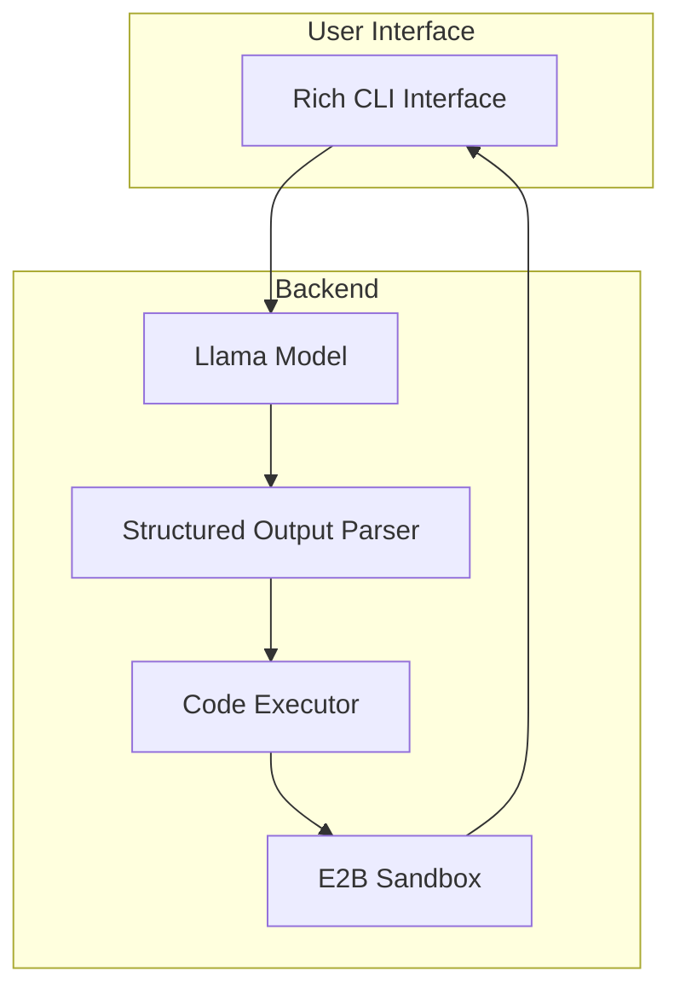

# Build a Code Execution Agent with Llama, E2B Sandbox and MAX Serve

This recipe demonstrates how to build a secure code execution assistant that combines:

* [Llama-3.1-8B-Instruct](https://huggingface.co/modularai/Llama-3.1-8B-Instruct-GGUF) for code generation
* [E2B Code Interpreter](https://e2b.dev/) for secure code execution in sandboxed environments
* [OpenAI's function calling format](https://platform.openai.com/docs/guides/function-calling) for structured outputs
* [Rich](https://rich.readthedocs.io/) for beautiful terminal interfaces
* [MAX Serve](https://docs.modular.com/max/serve/) for efficient model serving

The assistant provides:

1. **Secure code execution** in isolated sandboxes
2. **Interactive Python REPL** with natural language interface
3. **Beautiful output formatting** with syntax highlighting
4. **Clear explanations** of code and results

## Requirements

Please make sure your system meets our [system requirements](https://docs.modular.com/max/get-started).

To proceed, ensure you have the `magic` CLI installed with the `magic --version` to be **0.7.2** or newer:

```bash
curl -ssL https://magic.modular.com/ | bash
```

or update it via:

```bash
magic self-update
```

Then install `max-pipelines` via:

```bash
magic global install max-pipelines=="25.2.0.dev2025031705"
```

### Important: GPU requirements

This recipe requires a GPU with CUDA 12.5 support. Recommended GPUs:

* NVIDIA H100 / H200, A100, A40, L40

### API keys

1. **E2B API Key**: Required for sandbox access
   * Sign up at [e2b.dev](https://e2b.dev/)
   * Get your API key from the dashboard
   * Add to `.env` file: `E2B_API_KEY=your_key_here`

2. **Hugging Face Token** (optional): For faster model downloads
   * Get token from [Hugging Face](https://huggingface.co/settings/tokens)
   * Add to `.env` file: `HF_TOKEN=your_token_here`

### Installation

1. Download the code using the `magic` CLI:

    ```bash
    magic init code-execution-sandbox-agent-with-e2b --from modular/max-recipes/code-execution-sandbox-agent-with-e2b
    cd code-execution-sandbox-agent-with-e2b
    ```

2. Copy the environment template:

    ```bash
    cp .env.example .env
    ```

3. Add your API keys to `.env`

## Quick start

1. Test the sandbox:

    ```bash
    magic run hello
    ```

    This command runs a simple test to verify your E2B sandbox setup. You'll see a "hello world" output and a list of available files in the sandbox environment, confirming that code execution is working properly.

2. Start the LLM server:

    **Make sure the port `8010` is available. You can adjust the port settings in [pyproject.toml](./pyproject.toml).**

    ```bash
    magic run server
    ```

    This launches the Llama model with MAX Serve, enabling structured output parsing for reliable code generation. The server runs locally on port `8010` and uses the `--enable-structured-output` flag for OpenAI-compatible function calling.

3. Run the interactive agent:

    ```bash
    magic run agent
    ```

    This starts the interactive Python assistant. You can now type natural language queries like:
    * "calculate factorial of 5"
    * "count how many r's are in strawberry"
    * "generate fibonacci sequence up to 10 numbers"

The demo below shows the agent in action, demonstrating:

* Natural language code generation
* Secure execution in the E2B sandbox
* Beautiful output formatting with syntax highlighting
* Clear explanations of the code and results


## System architecture

The system follows a streamlined flow for code generation and execution:



Here's how the components work together:

1. **Rich CLI Interface**:
   * Provides a beautiful terminal interface
   * Handles user input in natural language
   * Displays code, results, and explanations in formatted panels

2. **Llama Model**:
   * Processes natural language queries
   * Generates Python code using structured output format
   * Runs locally via MAX Serve with function calling enabled

3. **Structured Output Parser**:
   * Validates LLM responses using Pydantic models
   * Ensures code blocks are properly formatted
   * Handles error cases gracefully

4. **Code Executor**:
   * Prepares code for execution
   * Manages the execution flow
   * Captures output and error states

5. **E2B Sandbox**:
   * Provides secure, isolated execution environment
   * Handles file system operations
   * Manages resource limits and timeouts

The flow ensures secure and reliable code execution while providing a seamless user experience with clear feedback at each step.

## Technical deep dive

### Hello world example ([hello.py](./hello.py))

The `hello.py` script demonstrates basic E2B sandbox functionality:

```python
from e2b_code_interpreter import Sandbox
from dotenv import load_dotenv
load_dotenv()

sbx = Sandbox() # Creates a sandbox environment
execution = sbx.run_code("print('hello world')") # Executes Python code

# Access execution results
for line in execution.logs.stdout:
    print(line.strip())

# List sandbox files
files = sbx.files.list("/")
```

Key features:

1. Sandbox initialization with automatic cleanup
2. Code execution in isolated environment
3. Access to execution logs and outputs
4. File system interaction capabilities

### Interactive agent ([agent.py](./agent.py))

The agent implements a complete code execution assistant with these additional key features:

1. **Environment Configuration**:

```python
LLM_SERVER_URL = os.getenv("LLM_SERVER_URL", "http://localhost:8010/v1")
LLM_API_KEY = os.getenv("LLM_API_KEY", "local")
MODEL = os.getenv("MODEL", "modularai/Llama-3.1-8B-Instruct-GGUF")
```

2. **Tool Definition for Function Calling**:

```python
tools = [{
    "type": "function",
    "function": {
        "name": "execute_python",
        "description": "Execute python code blocks in sequence",
        "parameters": CodeExecution.model_json_schema()
    }
}]
```

3. **Enhanced Code Execution with Rich Output**:

```python
def execute_python(blocks: List[CodeBlock]) -> str:
    with Sandbox() as sandbox:
        full_code = "\n\n".join(block.code for block in blocks)
        # Step 1: Show the code to be executed
        console.print(Panel(
            Syntax(full_code, "python", theme="monokai"),
            title="[bold blue]Step 1: Code[/bold blue]",
            border_style="blue"
        ))

        execution = sandbox.run_code(full_code)
        output = execution.logs.stdout if execution.logs and execution.logs.stdout else execution.text
        output = ''.join(output) if isinstance(output, list) else output

        # Step 2: Show the execution result
        console.print(Panel(
            output or "No output",
            title="[bold green]Step 2: Result[/bold green]",
            border_style="green"
        ))
        return output
```

4. **Three-Step Output Process**:
   * Code Display: Shows the code to be executed with syntax highlighting
   * Result Display: Shows the execution output in a green panel
   * Explanation: Provides a natural language explanation of the code and its result

5. **Interactive Session Management**:

```python
def main():
    console.print(Panel("Interactive Python Assistant (type 'exit' to quit)",
                 border_style="cyan"))

    while True:
        query = console.input("[bold yellow]Your query:[/bold yellow] ")
        if query.lower() in ['exit', 'quit']:
            console.print("[cyan]Goodbye![/cyan]")
            break
        # ... process query ...
```

6. **Explanation Generation**:

```python
explanation_messages = [
    {
        "role": "system",
        "content": "You are a helpful assistant. Explain what the code did and its result clearly and concisely."
    },
    {
        "role": "user",
        "content": f"Explain this code and its result:\n\nCode:\n{code}\n\nResult:\n{result}"
    }
]
```

### Structured output generation and parsing

The agent uses OpenAI's structured output format to ensure reliable code generation and execution. Here's how it works:

1. **Structured Data Models**:

```python
from pydantic import BaseModel
from typing import List

# Define the expected response structure
class CodeBlock(BaseModel):
    type: str
    code: str

class CodeExecution(BaseModel):
    code_blocks: List[CodeBlock]
```

2. **Tool Definition**:

```python
# Define the function calling schema
tools = [{
    "type": "function",
    "function": {
        "name": "execute_python",
        "description": "Execute python code blocks in sequence",
        "parameters": CodeExecution.model_json_schema()
    }
}]
```

3. **LLM Client Setup**:

```python
from openai import OpenAI

# Configure the client with local LLM server
client = OpenAI(
    base_url=LLM_SERVER_URL,  # "http://localhost:8010/v1"
    api_key=LLM_API_KEY       # "local"
)
```

4. **Message Construction**:

```python
messages = [
    {
        "role": "system",
        "content": """You are a Python code execution assistant. Generate complete, executable code based on user queries.

Important rules:
1. Always include necessary imports at the top
2. Always include print statements to show results
3. Make sure the code is complete and can run independently
4. Test all variables are defined before use
"""
    },
    {
        "role": "user",
        "content": query
    }
]
```

5. **Structured Response Parsing**:

```python
try:
    # Parse the response into structured format
    response = client.beta.chat.completions.parse(
        model=MODEL,
        messages=messages,
        response_format=CodeExecution
    )

    # Extract code blocks from the response
    code_blocks = response.choices[0].message.parsed.code_blocks

    # Execute the code
    result = execute_python(code_blocks)
except Exception as e:
    console.print(Panel(f"Error: {str(e)}", border_style="red"))
```

6. **Example Response Structure**:

```json
{
    "code_blocks": [
        {
            "type": "python",
            "code": "def factorial(n):\n    if n == 0:\n        return 1\n    return n * factorial(n-1)\n\nresult = factorial(5)\nprint(f'Factorial of 5 is: {result}')"
        }
    ]
}
```

7. **Explanation Generation**:

```python
# Generate explanation using vanilla completion
explanation_messages = [
    {
        "role": "system",
        "content": "You are a helpful assistant. Explain what the code did and its result clearly and concisely."
    },
    {
        "role": "user",
        "content": f"Explain this code and its result:\n\nCode:\n{code_blocks[0].code}\n\nResult:\n{result}"
    }
]

final_response = client.chat.completions.create(
    model=MODEL,
    messages=explanation_messages
)

explanation = final_response.choices[0].message.content
```

Key benefits of this structured approach:

1. **Type Safety**: Pydantic models ensure response validation
2. **Reliable Parsing**: Structured format prevents parsing errors
3. **Consistent Output**: Guaranteed code block structure
4. **Error Handling**: Clear error messages for parsing failures
5. **Separation of Concerns**:
   * Code generation with structured output
   * Code execution in sandbox
   * Explanation generation with free-form text

This structured approach ensures that:

* The LLM always generates valid, executable code
* The response can be reliably parsed and executed
* Error handling is consistent and informative
* The execution flow is predictable and maintainable

### Example interactions

You can interact with the agent using natural language queries like:

1. Basic calculations:

### Key components

1. **System Prompt**:
   * Ensures complete, executable code
   * Requires necessary imports
   * Mandates print statements for output
   * Enforces variable definition

2. **Code Execution Flow**:
   * Code generation by LLM
   * Parsing into structured blocks
   * Secure execution in sandbox
   * Result capture and formatting
   * Explanation generation

3. **Error Handling**:
   * Sandbox execution errors
   * JSON parsing errors
   * LLM response validation

## Customization options

1. **Model Selection**:

```python
MODEL = os.getenv("MODEL", "modularai/Llama-3.1-8B-Instruct-GGUF")
```

2. **Sandbox Configuration**:

```python
Sandbox(timeout=300)  # Configure timeout
```

3. **Output Formatting**:

```python
# Customize Rich themes and styles
console.print(Panel(..., theme="custom"))
```

## Troubleshooting

1. **Sandbox Issues**
   * Error: "Failed to create sandbox"
   * Solution: Check E2B API key
   * Verify network connection

2. **LLM Issues**
   * Error: "Failed to parse response"
   * Solution: Check server is running
   * Verify structured output format

3. **Code Execution Issues**
   * Error: "No output"
   * Solution: Check print statements
   * Verify code completeness

## Next steps

1. **Enhance the System**
   * Add file upload capabilities
   * Implement persistent sessions
   * Add support for more languages
   * Implement caching for responses

2. **Deploy to Production**
   * Deploy MAX Serve on [AWS, GCP or Azure](https://docs.modular.com/max/tutorials/max-serve-local-to-cloud/)
   * Set up CI/CD for documentation generation
   * Add monitoring and observability
   * Implement rate limiting and authentication

3. **Join the Community**
   * Explore [MAX documentation](https://docs.modular.com/max/)
   * Join our [Modular Forum](https://forum.modular.com/)
   * Share your projects with `#ModularAI` on social media

We're excited to see what you'll build with this foundation!
