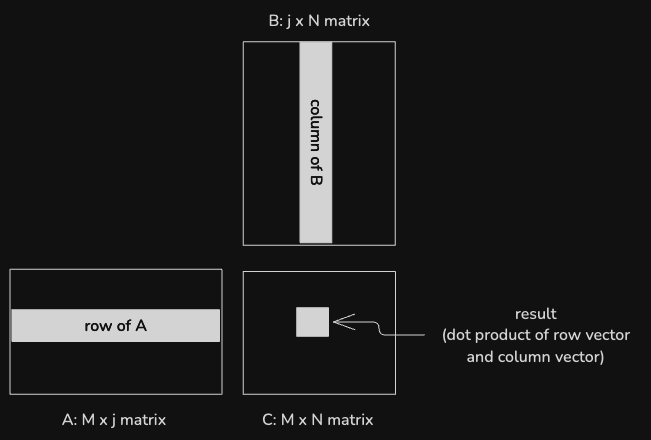
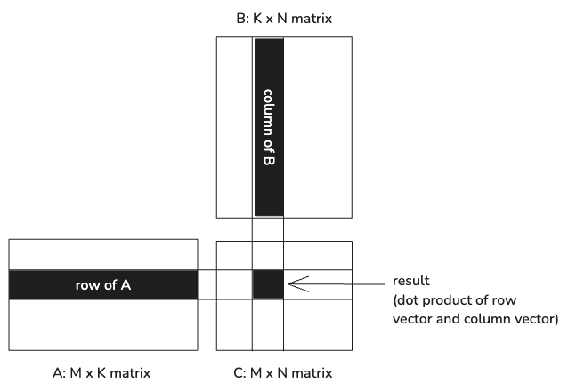
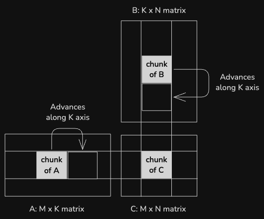
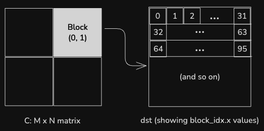
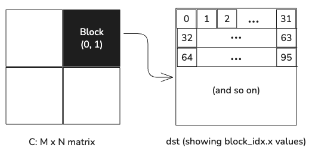
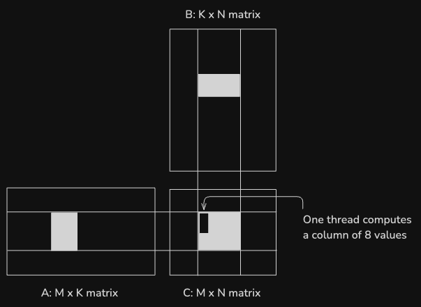
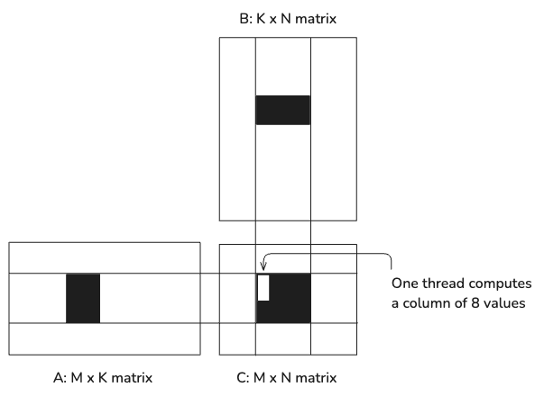

# Custom Operations: Optimizing Matrix Multiplication

In this recipe, we will cover:

* Defining a custom matrix multiplication operation for a MAX Graph.
* The use of Mojo high-performance GPU programming abstractions to
  progressively optimize a matrix multiplication.
* Accessing GPU hardware features, like Tensor Cores, from MAX.

We'll walk through an example that 

* defines a matrix multiplication running on a GPU,
* applies seven optimizations that sequentially improve GPU performance,
* and demonstrates the performance benefits with benchmarks of each step.

Let's get started.

## Requirements

Please make sure your system meets our
[system requirements](https://docs.modular.com/max/get-started).

To proceed, ensure you have the `magic` CLI installed:

```bash
curl -ssL https://magic.modular.com/ | bash
```

or update it via:

```bash
magic self-update
```

### GPU requirements

These examples can all be run on either a CPU or GPU. To run them on a GPU,
ensure your system meets
[these GPU requirements](https://docs.modular.com/max/faq/#gpu-requirements):

* Officially supported GPUs: NVIDIA Ampere A-series (A100/A10), or Ada
  L4-series (L4/L40) data center GPUs. Unofficially, RTX 30XX and 40XX series
  GPUs have been reported to work well with MAX.
* NVIDIA GPU driver version 555 or higher. [Installation guide here](https://www.nvidia.com/download/index.aspx).

## Quick start

1. Download this recipe using Magic:

```bash
magic init custom-ops-matrix-multiplication --from custom-ops-matrix-multiplication
cd custom-ops-matrix-multiplication
```

2. Run the example:

```bash
magic run matrix_multiplication
```

3. Run the benchmarks to see the impact of each optimization:

```bash
magic run benchmarks
```

## Optimizing a matrix multiplication for GPUs in MAX

AI models in [MAX](https://docs.modular.com/max/intro) are built as
computational graphs using the
[MAX Graph API](https://docs.modular.com/max/tutorials/get-started-with-max-graph-in-python).
MAX contains within it a powerful graph compiler that can take these graphs
and optimize them for best performance on a wide range of hardware.

Each node in a MAX Graph is defined by an operation that performs a calculation
on zero or more inputs and produces one or more outputs. These inputs and
outputs tend to be in the form of tensors, and the operations are usually
data-parallel calculations that are accelerated on CPUs or GPUs. In MAX,
these operations are written using [Mojo](https://docs.modular.com/mojo/manual/),
a Python-family language built for high-performance computation.

Matrix multiplications are key components in modern AI models, accounting for a
sizable fraction of the GPU workload when running these models. Optimizations
applied to matrix multiplication calculations can have a significant impact on
the throughput of models on GPUs.

To review, a matrix multiplication involves multiplying two matrices, A and B,
to produce a new matrix C.





Each value in the output matrix is the dot product of a row from A and a column 
from B. In a worst case scenario, when multiplying an MxK matrix by a KxN matrix,
calculating one output value requires loading `2 * K` values and performing `K`
floating-point multiplications.

MAX already contains leading-edge implementations of matrix multiplications,
tuned for various hardware architectures. Models built upon MAX Graphs can take
advantage of these optimized versions for best performance out of the box, but
it can be instructive to see how the code for a matrix multiplication can be
step-by-step tuned for GPU hardware.


### Structure of the custom operation

The matrix multiplication algorithms demonstrated here are encapsulated within
a custom MAX Graph operation. AI models in MAX are built from a graph of
operations like this, and in this case we're demonstrating one of these
operations running in isolation. The `matrix_multiplication.py` file exercises
seven different matrix multiplication algorithms using a single-operation graph
and shows that the results of multiplying two random matrices are the same for
each.

These results can be seen by running at the command line using

```sh
magic run matrix_multiplication
```

The single-operation graph is constructed using the following function:

```python
def matrix_multiplication(
    a: NDArray[np.float32],
    b: NDArray[np.float32],
    algorithm: str,
    session: InferenceSession,
    device: Device,
) -> Tensor:
    dtype = DType.float32

    a_tensor = Tensor.from_numpy(a).to(device)
    b_tensor = Tensor.from_numpy(b).to(device)

    with Graph(
        "matrix_multiplication_graph",
        input_types=[
            TensorType(dtype, shape=a_tensor.shape),
            TensorType(dtype, shape=b_tensor.shape),
        ],
    ) as graph:
        a_value, b_value = graph.inputs
        output = ops.custom(
            name="matrix_multiplication",
            values=[a_value, b_value],
            out_types=[
                TensorType(
                    dtype=a_value.tensor.dtype,
                    shape=[a_value.tensor.shape[0], b_value.tensor.shape[1]],
                )
            ],
            parameters={"algorithm": algorithm},
        )[0].tensor
        graph.output(output)

    print("Compiling...")
    model = session.load(graph)

    print("Executing...")
    result = model.execute(a_tensor, b_tensor)[0]
    return result.to(CPU())
```

A single `matrix_multiplication` operation is used, and the algorithm variant
is specified by the `algorithm` compile-time parameter.

The custom operation itself is defined in Mojo within the
`operations/matrix_multiplication.mojo` file. The `MatrixMultiplication` struct
hosts all of the setup code for taking in the matrix tensors, branching
execution based on whether the operation is running on CPU or GPU, and then
selecting and running a specific algorithm. Mojo supports compile-time
specialization of code based on parameters like target hardware, and that is
also extended here to user-supplied algorithm choice. Compiling only the code
paths used for a particular piece of hardware avoids run-time branching and
allows full utilization of an accelerator or CPU.

Each algorithm is contained within its own function in
`operations/matrix_multiplication.mojo`. Next, we'll discuss how each works.

### Matrix multiplication algorithms

The algorithms demonstrated in this example follow steps 1-6 in the progression
detailed by Simon Boehm in
[his excellent blog post](https://siboehm.com/articles/22/CUDA-MMM) on writing
performant matrix multiplications. Each algorithm is represented by a shortened
parameter name from the following list:

1. **naive**: Naive matrix multiplication with no optimizations.
2. **coalescing**: Applying memory coalescing.
3. **tiled**: Reworking to use shared memory tiling.
4. **tiled_register**: Using shared memory tiling and register tiling.
5. **block_tiled**: Introducing block tiling.
6. **block_tiled_vectorized**: Block tiling with vectorized memory access.
7. **tensor_core**: Using Tensor Cores for matrix multiplication.

The last algorithm is not from Simon's original list, but shows how to access
Tensor Core hardware using MAX in Mojo.

Each algorithm is meant to show a progressive improvement in performance of
matrix multiplication on GPUs. To start with, the impact of each optimization
can be seen by running a set of benchmarks against the algorithms in sequence:

```sh
magic run benchmarks
```

The results on an NVIDIA A100 GPU for 32-bit floats and input matrices sized
to 4096x4096 look like the following at the time this is written:

| Algorithm              | GFLOPS/s |
| ---------------------- | -------: |
| naive                  | 292      |
| coalescing             | 2936     |
| tiled                  | 3943     |
| tiled_register         | 7078     |
| block_tiled            | 10661    | 
| block_tiled_vectorized | 10663    |

The specific numbers may vary for your GPU, but the general progression should
be the same.

### Layouts and `LayoutTensor`

The `matrix_multiplication` custom operation uses
[layouts](https://docs.modular.com/mojo/stdlib/layout/layout/) and
[`LayoutTensor`](https://docs.modular.com/mojo/stdlib/layout/layout_tensor/LayoutTensor) to represent the
input and output matrices, so it's helpful to understand a little bit about
these types before getting started.

A _layout_ represents a mapping from a set of logical coordinates to a single,
one-dimensional coordinate—such as an array index or memory offset. For example,
a layout could represent a 2x6, row-major layout:

```mojo
my_layout = Layout.row_major(2, 6)
print_layout(my_layout)
```


```plaintext
       0    1    2    3    4    5
    +----+----+----+----+----+----+
 0  |  0 |  1 |  2 |  3 |  4 |  5 |
    +----+----+----+----+----+----+
 1  |  6 |  7 |  8 |  9 | 10 | 11 |
    +----+----+----+----+----+----+
```

A `LayoutTensor` consists of a layout and a pointer to memory. For example,
if you create a `LayoutTensor` using the layout shown above, the value at
(1, 1) is stored at memory offset 7.

A layout tensor can point to an existing buffer, or you can allocate memory
to store the tensor data. One `LayoutTensor` you'll see a lot in
the following sections is `tile()`, which returns a new `LayoutTensor` which is 
a subset of the original, but points to the same underlying data.

For example, you can extract a 2x2 tile of the above tensor:

```mojo
tile = my_tensor.tile[2, 2](0, 1)
```

The layout of the extracted tile looks like this:

```plaintext
       0    1   
    +----+----+
 0  |  2 |  3 |
    +----+----+
 1  |  8 |  9 |
    +----+----+
```

This just scratches the surface of layouts and `LayoutTensor`, which provide
powerful tools for manipulating data and writing parallel algorithms.

### Kernel 1: Naive matrix multiplication with no optimizations

The very first algorithm to start with is a "naive" matrix multiplication, one
that expresses the problem but makes no attempt at optimizing for how GPUs
actually work.

In Mojo, a basic matrix multiplication looks like the following:

```mojo
fn naive_matrix_multiplication[
    dtype: DType,
    a_layout: Layout,
    b_layout: Layout,
    c_layout: Layout,
    BM: Int,
    BN: Int,
](
    a: LayoutTensor[dtype, a_layout, MutableAnyOrigin],
    b: LayoutTensor[dtype, b_layout, MutableAnyOrigin],
    c: LayoutTensor[dtype, c_layout, MutableAnyOrigin],
):

    var M = a.dim(0)
    var N = b.dim(1)
    var K = b.dim(0)

    var row = block_dim.x * block_idx.x + thread_idx.x
    var col = block_dim.y * block_idx.y + thread_idx.y

    var dst_reg: c.element_type = 0

    if row < M and col < N:
        for k_index in range(K):
            dst_reg = dst_reg + a[row, k_index] * b[k_index, col]

    c[row, col] = dst_reg
```

However, if you glance up at the benchmark table in the previous section,
you'll see that the naive matrix multiplication is roughly only 2.7% as fast as
sixth algorithm on our list. There's clearly a lot of upside if this core
algorithm can be improved.

### Kernel 2: Applying memory coalescing

As one quick optimization that has an outsized impact, global memory accesses
can be coalesced by swapping the thread indices for columns and rows:

```mojo
var row = block_dim.y * block_idx.y + thread_idx.y
var col = block_dim.x * block_idx.x + thread_idx.x
```

With this change, adjacent threads access values in the same row of the
input matrices, which are contiguous in memory.

This leads to an almost tenfold jump in benchmarks on A100.

### Kernel 3: Reworking to use shared memory tiling

Shared memory on the GPU is far faster to access than global memory, so a next
step is to rework the matrix multiplication to tile the computation and load
values into shared memory. The input matrices A and B are loaded into shared 
memory in tiles of size BM x BK and BK x BN, respectively. Within the tile, 
values are accessed from shared memory, significantly reducing the memory access
latency in between arithmetic operations. Since each value in shared memory is used by BK threads (32 in this case), this greatly reduces the number of reads
from global memory.




This version corresponds to "Kernel 3: Shared Memory Cache-Blocking" in Simon's 
blog post.

Each thread is still computing a single output value, but it calculates a partial
result for each tile worth of input data, and accumulates the partial results 
to calculate the final value. 

The `LayoutTensor` `tile()` method provides a view to one tile of a tensor, and it
serves multiple purposes here.

The `dst` value is a view of the chunk of the output tensor that the current
block is responsible for generating. `dst` is a 32x32 chunk of the output
tensor, but instead of the 32x32 thread blocks used for previous kernels, this
kernel is invoked with a one-dimensional thread block of 32*32 threads. The
threads are mapped onto the output values in row-major order, like this:




As in the previous example, accessing memory in this order is more efficient for
the GPU, since it can coalesce adjacent memory accesses for adjacent threads in
the same warp.

This kernel uses the `LayoutTensorBuild` struct (imported as `tb` for brevity)
to allocate layout tensors in shared memory to hold cached chunks of the input
tensors.

The `copy_dram_to_sram_async()` function deserves special note. This takes the
place of the CUDA pattern of instructing each thread which value or values to
copy to shared memory. The `thread_layout` parameter associates individual
threads with values, and the function ensures efficient memory copies.

A full implementation of a tiled matrix multiplication in Mojo looks like the
following:

```mojo
fn tiled_matrix_multiplication[
    dtype: DType,
    a_layout: Layout,
    b_layout: Layout,
    c_layout: Layout,
    BM: Int,
    BN: Int,
    BK: Int,
    NUM_THREADS: Int,
](
    a: LayoutTensor[dtype, a_layout, MutableAnyOrigin],
    b: LayoutTensor[dtype, b_layout, MutableAnyOrigin],
    c: LayoutTensor[dtype, c_layout, MutableAnyOrigin],
):
    var col = thread_idx.x % BN
    var row = thread_idx.x // BN

    var dst = c.tile[BM, BN](block_idx.y, block_idx.x)

    var a_smem = tb[dtype]().row_major[BM, BK]().shared().alloc()
    var b_smem = tb[dtype]().row_major[BK, BN]().shared().alloc()

    var dst_reg: c.element_type = 0

    for block in range(b.dim(0) // BK):
        alias load_a_layout = Layout.row_major(NUM_THREADS // BK, BK)
        alias load_b_layout = Layout.row_major(BK, NUM_THREADS // BK)

        var a_tile = a.tile[BM, BK](block_idx.y, block)
        var b_tile = b.tile[BK, BN](block, block_idx.x)

        copy_dram_to_sram_async[thread_layout=load_a_layout](a_smem, a_tile)
        copy_dram_to_sram_async[thread_layout=load_b_layout](b_smem, b_tile)

        async_copy_wait_all()

        barrier()

        @parameter
        for k in range(BK):
            dst_reg += a_smem[row, k] * b_smem[k, col]

        barrier()

    dst[row, col] += dst_reg
```

This improves overall performance by ~30% over the previous optimization.

:::note

While faster on A100, this kernel may not show gains over the previous one
on all GPUs.

:::

### Kernel 4: Using shared memory tiling and register tiling

Expanding upon the advantages of using shared memory tiling, the partial
results can be accumulated in tiled registers and then the final results
transferred from there to global memory.

In this version, each thread is responsible for calculating multiple values
of C, further reducing the memory bandwidth required for each calculation.
Specifically, each thread calculates a column of 8 results:




Modifying the previous tiling to use
tiled registers looks like:

```mojo
fn tiled_register_matrix_multiplication[
    dtype: DType,
    a_layout: Layout,
    b_layout: Layout,
    c_layout: Layout,
    BM: Int,
    BN: Int,
    BK: Int,
    TM: Int,
    NUM_THREADS: Int,
](
    a: LayoutTensor[dtype, a_layout, MutableAnyOrigin],
    b: LayoutTensor[dtype, b_layout, MutableAnyOrigin],
    c: LayoutTensor[dtype, c_layout, MutableAnyOrigin],
):
    var col = thread_idx.x % BN
    var row = thread_idx.x // BN
    var bidx = block_idx.x
    var bidy = block_idx.y

    var dst = c.tile[BM, BN](bidy, bidx).tile[TM, 1](row, col)

    var a_smem = tb[dtype]().row_major[BM, BK]().shared().alloc()
    var b_smem = tb[dtype]().row_major[BK, BN]().shared().alloc()

    var dst_reg = tb[dtype]().layout[TM]().local().alloc()
    dst_reg.copy_from(dst)

    for block in range(b.dim(0) // BK):
        alias load_a_layout = Layout.row_major(NUM_THREADS // BK, BK)
        alias load_b_layout = Layout.row_major(BK, NUM_THREADS // BK)

        var a_tile = a.tile[BM, BK](block_idx.y, block)
        var b_tile = b.tile[BK, BN](block, block_idx.x)

        copy_dram_to_sram_async[thread_layout=load_a_layout](a_smem, a_tile)
        copy_dram_to_sram_async[thread_layout=load_b_layout](b_smem, b_tile)

        async_copy_wait_all()
        barrier()

        @parameter
        for k in range(BK):
            var a_tile = a_smem.tile[TM, 1](row, k)
            var b_tile = b_smem.tile[1, BN](k, 0)
            var b_val = b_tile[0, col]

            @parameter
            for t in range(TM):
                dst_reg[t] += a_tile[t, 0] * b_val

        barrier()

    dst.copy_from(dst_reg)

```

This gives a nearly 80% improvement over the previous tiling implementation.

### Kernel 5: Introducing block tiling

We can further increase the arithmetic intensity of the calculation using a
2-D block tiling strategy. In this kernel, each thread is responsible for calculating the output values for an 8x8 tile of the output tensor.

In addition to caching a block's worth of the A & B matrices in shared memory,
each thread copies the 8x8 tiles of the input matrices into local storage to
further reduce memory access latency. Then it uses the
[`outer_product_acc()`](https://docs.modular.com/mojo/stdlib/layout/math/outer_product_acc/) function to
calculate and accumulate the outer products of two vectors worth of values.

```mojo
fn block_tiled_matrix_multiplication[
    dtype: DType,
    a_layout: Layout,
    b_layout: Layout,
    c_layout: Layout,
    BM: Int,
    BN: Int,
    BK: Int,
    TM: Int,
    TN: Int,
    NUM_THREADS: Int,
](
    a: LayoutTensor[dtype, a_layout, MutableAnyOrigin],
    b: LayoutTensor[dtype, b_layout, MutableAnyOrigin],
    c: LayoutTensor[dtype, c_layout, MutableAnyOrigin],
):
    var partition_col = thread_idx.x % (BN // TN)
    var partition_row = thread_idx.x // (BN // TN)
    var bidx = block_idx.x
    var bidy = block_idx.y

    var dst = c.tile[BM, BN](bidy, bidx).tile[TM, TN](
        partition_row, partition_col
    )

    var a_smem = tb[dtype]().row_major[BM, BK]().shared().alloc()
    var b_smem = tb[dtype]().row_major[BK, BN]().shared().alloc()

    var dst_reg = tb[dtype]().row_major[TM, TN]().local().alloc()
    dst_reg.copy_from(dst)
    var a_reg = tb[dtype]().layout[TM]().local().alloc()
    var b_reg = tb[dtype]().layout[TN]().local().alloc()

    var ntiles = b.dim(0) // BK

    for block in range(ntiles):
        alias load_a_layout = Layout.row_major(NUM_THREADS // BK, BK)
        alias load_b_layout = Layout.row_major(BK, NUM_THREADS // BK)
        var a_tile = a.tile[BM, BK](block_idx.y, block)
        var b_tile = b.tile[BK, BN](block, block_idx.x)
        copy_dram_to_sram_async[thread_layout=load_a_layout](a_smem, a_tile)
        copy_dram_to_sram_async[thread_layout=load_b_layout](b_smem, b_tile)

        async_copy_wait_all()
        barrier()

        @parameter
        for k in range(BK):
            var a_tile = a_smem.tile[TM, 1](partition_row, k)
            var b_tile = b_smem.tile[1, TN](k, partition_col)
            a_reg.copy_from(a_tile)
            b_reg.copy_from(b_tile)
            outer_product_acc(dst_reg, a_reg, b_reg)
        barrier()

    dst.copy_from(dst_reg)
```

In the above benchmarks, this provides an additional 50% boost over the
previous algorithm.

### Kernel 6: Block tiling with vectorized memory access

As a final optimization, memory accesses can be vectorized to improve memory
access bandwidth. The only new thing in this kernel is the use of the 
[`LayoutTensor.vectorize()`](https://docs.modular.com/mojo/stdlib/layout/layout_tensor/LayoutTensor#vectorize)
method to produce vectorized views of the tensors, allowing multiple values to
be copied as a single SIMD vector.

```mojo
fn block_tiled_vectorized_matrix_multiplication[
    dtype: DType,
    a_layout: Layout,
    b_layout: Layout,
    c_layout: Layout,
    BM: Int,
    BN: Int,
    BK: Int,
    TM: Int,
    TN: Int,
    NUM_THREADS: Int,
](
    a: LayoutTensor[dtype, a_layout, MutableAnyOrigin],
    b: LayoutTensor[dtype, b_layout, MutableAnyOrigin],
    c: LayoutTensor[dtype, c_layout, MutableAnyOrigin],
):
    alias simd_width = simdwidthof[dtype]()
    var partition_col = thread_idx.x % (BN // TN)
    var partition_row = thread_idx.x // (BN // TN)
    var bidx = block_idx.x
    var bidy = block_idx.y

    var dst = c.tile[BM, BN](bidy, bidx).tile[TM, TN](
        partition_row, partition_col
    )
    var dst_vec = dst.vectorize[1, simd_width]()

    var a_smem = tb[dtype]().col_major[BM, BK]().shared().alloc()
    var b_smem = tb[dtype]().row_major[BK, BN]().shared().alloc()

    var dst_reg = tb[dtype]().row_major[TM, TN]().local().alloc()
    var dst_reg_vec = dst_reg.vectorize[1, simd_width]()
    dst_reg_vec.copy_from(dst_vec)

    var a_reg = tb[dtype]().layout[TM]().local().alloc()
    var b_reg = tb[dtype]().layout[TN]().local().alloc()

    var ntiles = b.dim(0) // BK

    for block in range(ntiles):
        alias load_a_layout = Layout.row_major(NUM_THREADS // BK, BK)
        alias load_b_layout = Layout.row_major(BK, NUM_THREADS // BK)
        var a_tile = a.tile[BM, BK](block_idx.y, block)
        var b_tile = b.tile[BK, BN](block, block_idx.x)

        copy_dram_to_sram_async[thread_layout=load_a_layout](
            a_smem.vectorize[simd_width, 1](), a_tile.vectorize[simd_width, 1]()
        )
        copy_dram_to_sram_async[thread_layout=load_b_layout](
            b_smem.vectorize[1, simd_width](), b_tile.vectorize[1, simd_width]()
        )

        async_copy_wait_all()
        barrier()

        @parameter
        for k in range(BK):
            var a_tile = a_smem.tile[TM, 1](partition_row, k)
            var b_tile = b_smem.tile[1, TN](k, partition_col)
            a_reg.copy_from(a_tile)
            b_reg.copy_from(b_tile)

            outer_product_acc(dst_reg, a_reg, b_reg)

        barrier()

    dst_vec.copy_from(dst_reg_vec)
```

From beginning to end, we've realized more than a 36X improvement in matrix
multiplication speed within our MAX custom operation!

### Kernel 7: Using Tensor Cores for matrix multiplication

Modern GPUs have dedicated hardware units for performing accelerated matrix
multiplication called Tensor Cores. These Tensor Cores can perform matrix
multiplications an order of magnitude or more faster than general purpose GPU
hardware. However, they can be a challenge to work with.

MAX contains interfaces that make it more ergonomic to program these dedicated
hardware units. The following is an example of how to perform the same
calculation as the above, only on a Tensor Core:

```mojo
fn tensor_core_matrix_multiplication[
    dtype: DType,
    layout_a: Layout,
    layout_b: Layout,
    layout_c: Layout,
    BM: Int,
    BN: Int,
    BK: Int,
    WM: Int,
    WN: Int,
    MMA_M: Int,
    MMA_N: Int,
    MMA_K: Int,
](
    A: LayoutTensor[dtype, layout_a, MutableAnyOrigin],
    B: LayoutTensor[dtype, layout_b, MutableAnyOrigin],
    C: LayoutTensor[dtype, layout_c, MutableAnyOrigin],
):
    alias M = C.shape[0]()
    alias N = C.shape[1]()
    alias K = A.shape[1]()

    var warp_id = thread_idx.x // WARP_SIZE

    warp_y = warp_id // (BN // WN)
    warp_x = warp_id % (BN // WN)

    C_warp_tile = C.tile[BM, BN](block_idx.y, block_idx.x).tile[WM, WN](
        warp_y, warp_x
    )

    mma_op = TensorCore[A.dtype, C.dtype, Index(MMA_M, MMA_N, MMA_K)]()

    A_sram_tile = tb[A.dtype]().row_major[BM, BK]().shared().alloc()
    B_sram_tile = tb[B.dtype]().row_major[BK, BN]().shared().alloc()

    c_reg = (
        tb[C.dtype]()
        .row_major[WM // MMA_M, (WN * 4) // MMA_N]()
        .local()
        .alloc()
        .fill(0)
    )

    for k_i in range(K // BK):
        barrier()

        A_dram_tile = A.tile[BM, BK](block_idx.y, k_i)
        B_dram_tile = B.tile[BK, BN](k_i, block_idx.x)

        copy_dram_to_sram_async[thread_layout = Layout.row_major(4, 8)](
            A_sram_tile.vectorize[1, 4](), A_dram_tile.vectorize[1, 4]()
        )
        copy_dram_to_sram_async[thread_layout = Layout.row_major(4, 8)](
            B_sram_tile.vectorize[1, 4](), B_dram_tile.vectorize[1, 4]()
        )

        async_copy_wait_all()
        barrier()

        A_warp_tile = A_sram_tile.tile[WM, BK](warp_y, 0)
        B_warp_tile = B_sram_tile.tile[BK, WN](0, warp_x)

        @parameter
        for mma_k in range(BK // MMA_K):

            @parameter
            for mma_m in range(WM // MMA_M):

                @parameter
                for mma_n in range(WN // MMA_N):
                    c_reg_m_n = c_reg.tile[1, 4](mma_m, mma_n)

                    A_mma_tile = A_warp_tile.tile[MMA_M, MMA_K](mma_m, mma_k)
                    B_mma_tile = B_warp_tile.tile[MMA_K, MMA_N](mma_k, mma_n)

                    a_reg = mma_op.load_a(A_mma_tile)
                    b_reg = mma_op.load_b(B_mma_tile)

                    var d_reg_m_n = mma_op.mma_op(
                        a_reg,
                        b_reg,
                        c_reg_m_n,
                    )

                    c_reg_m_n.copy_from(d_reg_m_n)

    @parameter
    for mma_m in range(WM // MMA_M):

        @parameter
        for mma_n in range(WN // MMA_N):
            var C_mma_tile = C_warp_tile.tile[MMA_M, MMA_N](mma_m, mma_n)
            var c_reg_m_n = c_reg.tile[1, 4](mma_m, mma_n)
            mma_op.store_d(C_mma_tile, c_reg_m_n)
```

## Conclusion

In this recipe, we've demonstrated how to create a custom MAX Graph operation
that performs matrix multiplication using various algorithms and run that on a
GPU. We ran benchmarks of each algorithm, showing the performance benefits of
various algorithmic improvements. Each improvement was described in detail,
showing pathways to get the most speed out of modern GPUs using MAX and Mojo.

## Next Steps

* Follow [our tutorial for building a custom operation from scratch](https://docs.modular.com/max/tutorials/build-custom-ops).

* See the [GPU programming](https://docs.modular.com/mojo/manual/gpu/gpu-basics)
  page in the Mojo manual.

* Explore MAX's [documentation](https://docs.modular.com/max/) for additional
  features. The [`gpu`](https://docs.modular.com/mojo/stdlib/gpu/) module has
  detail on Mojo's GPU programming functions and types, and the documentation
  on [`@compiler.register`](https://docs.modular.com/max/api/mojo-decorators/compiler-register/)
  shows how to register custom graph operations.

* Join our [Modular Forum](https://forum.modular.com/) and [Discord community](https://discord.gg/modular) to share your experiences and get support.

We're excited to see what you'll build with MAX! Share your projects and experiences with us using `#ModularAI` on social media.
