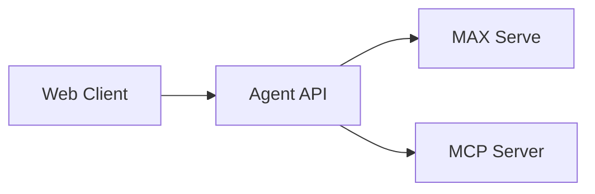

# MAX FastMCP: Build AI Agents with Model Context Protocol

This recipe demonstrates how to create AI agents that leverage Model Context Protocol (MCP) servers using MAX. You'll learn how to build an agent that discovers and uses MCP tools dynamically, enabling your AI models to interact with external systems through a standardized protocol.

## What You'll Build

- AI agent that can discover and use MCP tools at runtime
- Simple MCP server with FastMCP
- FastAPI service that bridges a MAX model with an MCP server
- Web UI for interacting with your agent, using Alpine.js and Pico CSS

## Requirements

- Python 3.12 or higher
- MAX 25.3.0 or higher
- FastMCP 2.3.4 or higher

## Quick Start

For this recipe, you will need:

- A valid [Hugging Face token](https://huggingface.co/settings/tokens) for accessing Llama 3
- Access to the [meta-llama/Llama-3.2-1B-Instruct](https://huggingface.co/meta-llama/Llama-3.2-1B-Instruct) model

### 1. Install Dependencies

```bash
# Install uv (if not already installed)
curl -LsSf https://astral.sh/uv/install.sh | sh
source ~/.bashrc  # or ~/.zshrc

# Clone the repository
git clone https://github.com/modularml/max-recipes.git
cd max-recipes/max-fastmcp
```

### 2. Configure Environment

Create a `.env` file with your configuration:

```bash
cp .env.sample .env
echo "HUGGING_FACE_HUB_TOKEN=your_hf_token" >> .env
```

#### Optional: Configure Model Weights

The `.env.sample` file includes an optional `MODEL_WEIGHTS` configuration for quantized CPU weights. If you don't have a GPU available or want to use CPU-only inference, uncomment this line:

```bash
MODEL_WEIGHTS="bartowski/Llama-3.2-1B-Instruct-GGUF/Llama-3.2-1B-Instruct-Q4_K_M.gguf"
```

For GPU requirements and compatibility information, see the [MAX GPU Requirements](https://docs.modular.com/max/faq#gpu-requirements) documentation.

### 3. Start the Services

The easiest way to run all services is using the [Invoke](https://www.pyinvoke.org/) task runner:

```bash
# Start all services (MAX server, demo MCP server, and Agent API)
uv run invoke app
```

Or run services individually:

```bash
# Terminal 1: Start MAX model server
uv run invoke max

# Terminal 2: Start the demo MCP server  
uv run invoke mcp

# Terminal 3: Start the agent API
uv run invoke api
```

Note: The `demo_mcp_server` is a separate module that runs independently from the agent, demonstrating how MCP servers and agents maintain clean separation of concerns.

### 4. Test the Agent

The agent provides both a web UI and REST API for interaction:

#### Using the Web UI

1. Open your browser to http://localhost:8000
2. Enter a natural language query (e.g., "How many R's are in strawberry?")
3. Click "Send" to see the results

#### Using the REST API

```bash
# Query the agent with a counting task
curl -X POST http://localhost:8000/api/count \
    -H "Content-Type: application/json" \
    -d '{"query": "Count the letter L in Hello World"}'
```

Example response:

```json
{
  "char_found": "l",
  "in_string": "Hello World",
  "num_times": 3
}
```

## Understanding the Architecture

### System Overview



### Core Components

1. **Agent API** (`max_mcp_agent/`): FastAPI service that orchestrates the interaction between the MAX model and MCP server
   - Serves a web UI at `/` for browser-based interaction
   - Exposes REST API at `/api/count` for programmatic access
   - Handles CORS for cross-origin requests

2. **Demo MCP Server** (`demo_mcp_server/`): A simple example MCP server that provides a character counting tool - this is intentionally separate from the agent to demonstrate clean architecture

3. **Web Interface** (`max_mcp_agent/static/`): Simple, responsive UI built with:
   - Alpine.js for reactive state management
   - Pico CSS for minimal, elegant styling
   - Vanilla JavaScript for API communication

4. **MCP Client Integration**: Uses FastMCP to discover and call tools from MCP servers

5. **OpenAI-Compatible Interface**: Leverages MAX's OpenAI-compatible API for seamless integration with the OpenAI Python client

## Technical Deep Dive

### Agent Workflow

The agent follows a structured workflow for processing queries:

```python
# 1. Initialize clients
openai_client = OpenAI(base_url=MAX_SERVE_URL, api_key="EMPTY")
mcp_client = MCPClient(MCP_URL)

# 2. Create session with user query
session = await _init_session(query, openai_client, mcp_client)

# 3. Discover available MCP tools
session = await _discover_tools(session)

# 4. Send message to LLM with tools
session = await _send_message(session)

# 5. Execute tool calls if needed
session = await _call_tool(session)

```

### MCP Tool Discovery

The agent dynamically discovers tools from the MCP server and formats them for use with the OpenAI Python client:

```python
async def _discover_tools(session: ChatSession) -> ChatSession:
    mcp_tools = await session.mcp_client.list_tools()
    tools = []
    
    for tool in mcp_tools:
        formatted_tool = {
            "type": "function",
            "function": {
                "name": tool.name,
                "description": tool.description,
                "parameters": tool.inputSchema,
            },
        }
        tools.append(formatted_tool)
    
    session.tools = tools
    return session
```

## Extending the Agent

The following are a couple ways you can build upon this recipe for your own use cases.

### Implementing Multi-Turn Conversations

The current implementation in `agent.py` provides a clean foundation that demonstrates a **single-tool workflow**:

1. Receives a user query
2. Discovers available tools
3. Sends the query to the LLM with tools
4. Executes **ONE** tool call if requested
5. Returns the result

This architecture is intentionally simple to showcase the core MCP integration. You can enhance it to support:

- **Multiple sequential tool calls**: Enable the agent to use multiple tools in sequence to solve complex problems
- **Conversation loops**: Allow back-and-forth interactions where tool results inform follow-up questions
- **Complex multi-step workflows**: Build agents that can plan and execute sophisticated task sequences
- **Stateful conversations**: Maintain context across multiple user interactions

For inspiration on implementing these enhancements, explore these examples from other MAX recipes:

- **deepseek-qwen-autogen-agent/chat_agent.py**: The `main()` function demonstrates a simple conversation loop with history management
- **autodoc-repo-chat-agent/main.py**: The `ChatHandler` and `RepoQAHandler` classes show sophisticated context management with sliding windows
- **ai-weather-agent/backend/src/main.py**: The `fetch_all_weather_data()` function demonstrates parallel multi-tool coordination

### Adding New MCP Tools

The `demo_mcp_server` module provides a simple example of an MCP server with a single tool:

```python
@mcp.tool()
def count_characters(
    character: str,
    string: str,
) -> ToolResponse:
    """Counts the occurrences of a character within a string"""
    count = string.lower().count(character.lower())
    return ToolResponse(char_found=character, in_string=string, num_times=count)
```

This demonstrates the simplicity of creating MCP tools - just a Python function with a decorator. The separation between the `demo_mcp_server` and `max_mcp_agent` modules is intentional, showing how:

1. MCP servers can be developed independently from MCP clients
2. Agents can discover tools and use dynamically at runtime

You can extend this by:

1. **Adding tools to the demo server**: Simply add more `@mcp.tool()` decorated functions

2. **Creating new MCP servers**: Build separate MCP servers for different domains (database operations, file management, API integrations, etc.)

3. **Integrating existing MCP servers**: Connect to any MCP-compatible server by updating the `MCP_URL` in your configuration

4. **Running multiple MCP servers**: Modify the agent to connect to multiple MCP endpoints for access to diverse tool sets

## Task Automation with Invoke

This project uses [Invoke](https://www.pyinvoke.org/) for task automation. All tasks are defined in `tasks.py` and can be run with `uv run invoke <task>`.

### Available Tasks

```bash
# Start all services with automatic health checks
uv run invoke app

# Run individual services
uv run invoke api    # Start the Agent API server
uv run invoke mcp    # Start the MCP demo server  
uv run invoke max    # Start the MAX model server

# Clean up ports (useful if services didn't shut down cleanly)
uv run invoke clean
uv run invoke clean --ports=8000,8001,8002
```

### How It Works

The `tasks.py` file defines several key tasks:

1. **`app`**: Orchestrates all three services using Honcho process manager
   - Automatically cleans up ports before starting
   - Manages all services in a single terminal
   - Handles graceful shutdown

2. **`api`**: Starts the Agent API with health check waiting
   - Waits for MAX and MCP services to be healthy
   - Retries health checks with exponential backoff
   - Only starts once dependencies are ready

3. **`max`**: Launches the MAX model server
   - Configures the model and weights paths
   - Uses GGUF quantized weights for efficiency

4. **`mcp`**: Runs the demo MCP server (`demo_mcp_server` module)
   - Provides a simple character counting tool as an example
   - Runs independently from the agent
   - Uses debug logging for development

5. **`clean`**: Port cleanup utility
   - Kills processes occupying specified ports
   - Useful for development when services don't shut down cleanly

## Troubleshooting

### Common Issues

1. **Connection Refused**: Ensure all three services are running and ports are available

2. **Tool Not Found**: Verify the MCP server is running and accessible at the configured URL

3. **Model Loading Issues**: Ensure you have access to the [meta-llama/Llama-3.2-1B-Instruct](https://huggingface.co/meta-llama/Llama-3.2-1B-Instruct) model

### Debug Mode

Enable detailed logging:

```python
import logging
logging.basicConfig(level=logging.DEBUG)
```

## What's Next

- Explore the [MCP specification](https://modelcontextprotocol.io) to understand the protocol
- Build custom MCP servers for your specific use cases
- Integrate with existing MCP-compatible tools
- Scale the agent with multiple MCP servers

## Resources

- [MAX Documentation](https://docs.modular.com/max/)
- [FastMCP Documentation](https://github.com/jlowin/fastmcp)
- [Model Context Protocol](https://modelcontextprotocol.io)
- [Modular Community Forum](https://forum.modular.com/)

---

If you build an agent with this recipe, please share it with the [Modular community](https://forum.modular.com/). Happy building!
