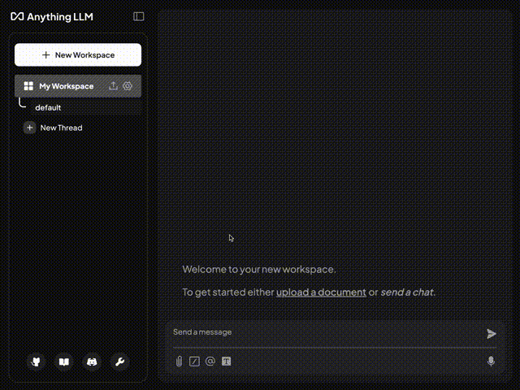

# Use AnythingLLM with MAX

Building on the solid foundation MAX provides, adding a robust user interface is a natural next step.



In this recipe you will:

- Use MAX to serve an OpenAI-compatible endpoint for [Llama 3.1](https://ai.meta.com/blog/meta-llama-3-1/)
- Set up [AnythingLLM](https://github.com/Mintplex-Labs/anything-llm) to provide a robust chat interface
- Learn how to orchestrate multiple services in pure Python, without tools like Kubernetes or docker-compose

## About AnythingLLM

AnythingLLM is a powerful platform offering a familiar chat interface for interacting with open-source AI models. Like MAX, AnythingLLM empowers users to maintain complete ownership of their AI infrastructure, avoiding vendor lock-in risks, and enhancing privacy. With [over 40,000 stars on GitHub](https://github.com/Mintplex-Labs/anything-llm), AnythingLLM has become one of the most popular solutions for private AI deployment. The platform's versatility allows it to work perfectly with MAX to create a complete end-to-end AI solution.

## Requirements

Please make sure your system meets our [system requirements](https://docs.modular.com/max/faq/#system-requirements).

### Pixi

To proceed, ensure you have the `pixi` CLI installed:

```bash
curl -fsSL https://pixi.sh/install.sh | sh
```

...or update `pixi` to the latest version:

```bash
pixi self-update
```

For this recipe, you will need a valid [Hugging Face token](https://huggingface.co/settings/tokens) to access the model.
Once you have obtained the token, include it in `.env` by running:

```bash
echo "HUGGING_FACE_HUB_TOKEN=your_token_here" >> .env
```

### Docker

We'll use Docker to run the AnythingLLM container. Follow the instructions in the [Docker documentation](https://docs.docker.com/desktop/) if you need to install it.

## Quick start

1. Download the code for this recipe:

   ```bash
   git clone https://github.com/modularml/max-recipes.git
   cd max-recipes/max-serve-anythingllm
   ```

2. Start MAX and AnythingLLM with one command:

```bash
pixi run app
```

This command is defined in the `pyproject.toml` file which we will cover later.

MAX is ready once you see a line containing the following in the log output:

```plaintext
max.serve: Server ready on http://0.0.0.0:3002/
```

AnythingLLM is ready once you see a line like the following in the log output:

```plaintext
Primary server in HTTP mode listening on port 3001
```

Note: the port that AnythingLLM reports can differ from the port you configure in `pyroject.toml` as the `UI_PORT`.

Once both servers are ready, launch AnythingLLM in your browser at [http://localhost:3001](http://localhost:3001)

## Using AnythingLLM

When you run the command `pixi run app`, the Python script `main.py` will orchestrate getting both MAX and AnythingLLM up and running. Notably, it will create a `data` folder if one doesn't exist. AnythingLLM uses this folder as persistent storage for your settings, chat history, etc. The location of the folder is configurable within `pyproject.toml` by changing the value of `UI_STORAGE_LOCATION`.

The first time you [launch AnythingLLM in your browser](http://localhost:3001), you will see a welcome screen. Choose *Get Started*, then complete the following steps:

1. Select *Generic OpenAI* as the LLM provider, then enter:
    - Base URL = `http://host.docker.internal:3002/v1`
    - API Key = `local` (MAX doesn't require an API key, but this field can't be blank)
    - Chat Model Name = `modularai/Llama-3.1-8B-Instruct-GGUF`
    - Token Context Window = `16384` (Must match `MAX_CONTEXT_LENTH` from `pyproject.toml`)
    - Max Tokens = `1024`
2. Next, for User Setup, choose *Just me* or *My team*, and set an admin password.
3. If asked to fill in a survey, you may participate or skip this step. (The survey data goes to the AnythingLLM project, not Modular.)
4. Finally, enter a workspace name.

Note: Don't let the `modularai` in the Chat Model Name field limit you. MAX supports any PyTorch model on Hugging Face, and includes special acceleration for the most common architectures. Modular simply hosts weights for Llama 3.1 to get you up and running quickly. (Access to the official [meta-llama repo](https://huggingface.co/meta-llama/Llama-3.1-8B-Instruct) is gated and requires waiting for approval.)

## Understand the project

Let's explore how the key components of this recipe work together.

### Configuration: pyproject.toml

The recipe is configured in the `pyproject.toml` file, which defines:

1. **Environment variables** to control the ports, storage locations, and additional settings:
   - `MAX_SECRETS_LOCATION = ".env"`: Location of file containing your Hugging Face token
   - `MAX_CONTEXT_LENGTH = "16384"`: LLM context window size
   - `MAX_BATCH_SIZE = "1"`: LLM batch size (use 1 when running on CPU)
   - `MAX_SERVE_PORT = "3002"`: Port for MAX
   - `UI_PORT = "3001"`: Port for AnythingLLM
   - `UI_STORAGE_LOCATION = "./data"`: Persistent storage for AnythingLLM
   - `UI_CONTAINER_NAME = "anythingllm-max"`: Name for referencing the container with Docker

2. **Tasks** you can run with the `pixi run` command:
   - `app`: Runs the main Python script that coordinates both services
   - `setup`: Sets up persistent storage for AnythingLLM
   - `ui`: Launches the AnythingLLM Docker container
   - `llm`: Starts MAX with Llama 3.1
   - `clean`: Cleans up network resources for both services

3. **Dependencies** for running both services:
   - MAX runs via the `modular` package
   - AnythingLLM runs in a Docker container, keeping its dependencies isolated
   - Additional dependencies to orchestrate both services

### Initial Setup: setup.py

The `setup.py` script handles the initial setup for AnythingLLM:

- Reads the `UI_STORAGE_LOCATION` from `pyproject.toml`
- Creates the storage directory if it doesn't exist
- Ensures an empty `.env` file is present for AnythingLLM settings
- This script is automatically run as a pre-task when you execute `pixi run app`

### Orchestration: main.py

When you run `pixi run app`, the `main.py` script coordinates everything necessary to start and shutdown both services:

1. **Command-line Interface**
   - Uses [Click](https://click.palletsprojects.com/en/stable/) to provide a simple CLI
   - Supports main tasks to run concurently, pre-tasks, and post-tasks
   - Default command from pyproject.toml runs: `python main.py llm ui --pre setup --post clean`

2. **run_app()**
   - Loads environment variables, including those from the configured secrets location
   - Uses [Honcho](https://honcho.readthedocs.io/en/latest/) to run multiple `pixi run` tasks concurrently
   - Starts both the MAX LLM backend and AnythingLLM UI

3. **run_task()**
   - Executes individual tasks like `setup` or `clean`
   - Reads task definitions from `pyproject.toml`
   - Pre-tasks run before main tasks, post-tasks are registered with `atexit` to ensure cleanup

4. **Cleanup Process**
   - Post-tasks (like `clean`) are automatically run when the application exits
   - The `clean` task terminates all processes, releases all ports, and removes the AnythingLLM container from Docker

## What's next?

Now that you're up and running with AnythingLLM on MAX, you can explore more features and join our developer community. Here are some resources to help you continue your journey:

- [Get started with MAX](https://docs.modular.com/max/get-started)
- Explore [MAX serving](https://docs.modular.com/max/serve) and the [MAX container](https://docs.modular.com/max/container/)
- Learn more about [Pixi](https://pixi.sh/docs/)
- Join the [Modular forum](https://forum.modular.com/)
