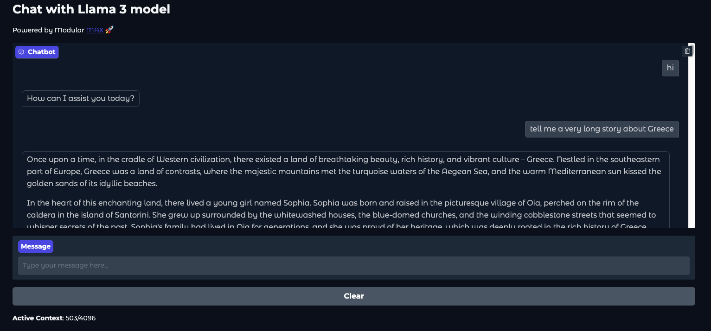
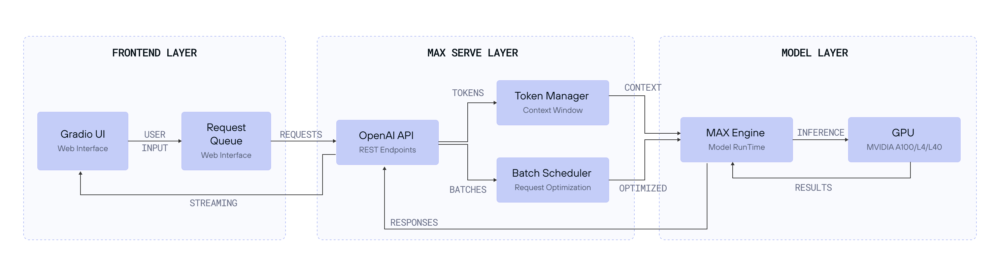

# Build a Continuous Chat App with MAX Serve and Llama 3

In this recipe, we will cover:

* How to set up a chat application using Llama 3 and MAX.
* Implementing efficient token management through rolling context windows.
* Handling concurrent requests for optimal performance.
* Containerizing and deploying your application with Docker Compose.

We'll walk through building a solution that showcases

* MAX Serve capabilities
* featuring efficient token management through rolling context windows
* concurrent request handling
* and straightforward deployment using Docker Compose for demonstration.

Let's get started.

## Requirements

Please make sure your system meets our [system requirements](https://docs.modular.com/max/get-started).

To proceed, ensure you have the `magic` CLI installed:

```bash
curl -ssL https://magic.modular.com/ | bash
```

or update it via:

```bash
magic self-update
```

You'll need:

* A valid [Hugging Face token](https://huggingface.co/settings/tokens) for accessing Llama 3
* Access to [meta-llama/Llama-3.1-8B-Instruct](https://huggingface.co/meta-llama/Llama-3.1-8B-Instruct) model

### GPU requirements

For running the app on GPU, ensure your system meets these GPU requirements:

* Supported GPUs: NVIDIA A100 (optimized), A10G, L4, or L40.
* (Optional) Docker and Docker Compose: Installed with [NVIDIA GPU support](https://docs.docker.com/config/containers/resource_constraints/#gpu).
* NVIDIA Drivers: [Installation guide here](https://www.nvidia.com/download/index.aspx).
* NVIDIA Container Toolkit: [Installation guide here](https://docs.nvidia.com/datacenter/cloud-native/container-toolkit/install-guide.html).

**Docker and Docker Compose are optional. Note that this recipe works on compatible Linux machines. We are actively working on enabling MAX Serve Docker image for MacOS ARM64 as well.**

## Quick start

1. Download the code for this recipe using the `magic` CLI:

    ```bash
    magic init max-serve-continuous-chat --from modular/max-recipes/max-serve-continuous-chat
    cd max-serve-continuous-chat
    ```

2. Set up your environment variables:

    ```bash
    cp .env.sample .env
    echo "HUGGING_FACE_HUB_TOKEN=your_hf_token" > .env
    ```

3. Run the chat app:

    ```bash
    magic run app
    ```

    Once the Llama3 server and UI server are running, open <http://localhost:7860> to view the chat interface.

    

4. And once done with the app, to clean up the resources run:

    ```bash
    magic run clean
    ```

### (Optional) Attaching to a remote endpoint

If you don't have access to the supported NVIDIA GPU locally, you can instead follow our tutorials
on deploying Llama 3 on GPU with MAX Serve to [AWS, GCP or Azure](https://docs.modular.com/max/tutorials/max-serve-local-to-cloud/)
or on [Kubernetes](https://docs.modular.com/max/tutorials/deploy-max-serve-on-kubernetes/) to get a public IP
(running on port 80) and then run the UI component separately as follows:

1. Build the UI docker image for your platform separately:

    ```bash
    # required only once
    docker buildx create --use --name mybuilder

    # Intel, AMD
    docker buildx bake --load --set "ui.platform=linux/amd64"
    # OR for ARM such as Apple M-series
    docker buildx bake --load --set "ui.platform=linux/arm64"
    ```

2. Run the UI docker image with your `BASE_URL` to the available endpoint:

    ```bash
    docker run -p 7860:7860 \
    -e "BASE_URL=http://<PUBLIC_IP>/v1" \
    -e "HUGGING_FACE_HUB_TOKEN=${HUGGING_FACE_HUB_TOKEN}" \
    llama3-chat-ui
    ```

3. For clean up, make sure to remove the builder too:

    ```bash
    docker buildx rm mybuilder
    ```

## Features of Llama 3 chat app

* **Gradio-based interface**: A sleek, interactive UI built with [Gradio](https://www.gradio.app/) for intuitive interactions.
* **Seamless integration**: Leverages Llama 3 models via MAX Serve on GPU, ensuring rapid and efficient chat responses.
* **Customizable environment**: Adjust settings like context window size, batch size, and system prompts to suit your needs.
* **Efficient continuous chat**: Employs a rolling context window implementation that dynamically maintains the chat context without exceeding the maximum token limit.

## Architecture overview

Our chat application consists of three main components:

1. **Frontend layer**: A Gradio-based web interface that provides real-time chat interactions.
2. **MAX Serve layer**: Our OpenAI-compatible API server that handles:
    * Request batching and scheduling through advanced techniques such as continuous batching.
    * Token management and context windows.
    * Model inference optimization.‍
3. **Model Layer**: Llama 3 running on MAX Engine, optimized for GPU inference.



## Technical deep dive

### Continuous chat with rolling context window

A key feature of our chat application is the rolling context window. This mechanism ensures that conversations remain coherent and contextually relevant without overwhelming system resources. Here's an in-depth look at how this is achieved:

#### 1. Dynamic token management

The `ChatConfig` class is responsible for tracking token usage and maintaining a rolling window of messages within the configured token limit. Tokens are the fundamental units processed by language models, and managing them efficiently is crucial for performance and cost-effectiveness.

```python

class ChatConfig:
    def __init__(self, base_url: str, max_context_window: int):
        self.base_url = base_url
        self.max_context_window = max_context_window
        self.tokenizer = AutoTokenizer.from_pretrained("meta-llama/Meta-Llama-3.1-8B-Instruct")

    def count_tokens(self, messages: List[Dict]) -> int:
        num_tokens = 0
        for message in messages:
            text = f"<|im_start|>{message['role']}\\n{message['content']}<|im_end|>\\n"
            num_tokens += len(self.tokenizer.encode(text))
        return num_tokens
```

How it works:

* **Token counting**: Each message's content is wrapped with special tokens (`<|im_start|>` and `<|im_end|>`) to denote the start and end of a message. The tokenizer then encodes this text and counts the number of tokens.
* **Configuration**: The `max_context_window` parameter defines the maximum number of tokens allowed in the conversation context. This ensures that the application doesn't exceed the model's capacity, maintaining efficiency.

### 2. Prioritized message inclusion

To maintain the conversation's relevance, the latest user and system messages are always included. Older messages are trimmed dynamically when the token count exceeds the window size.

```python
if chat_history:
    for user_msg, bot_msg in reversed(chat_history):
        new_messages = [
            {"role": "user", "content": user_msg},
            {"role": "assistant", "content": bot_msg},
        ]
        history_tokens = config.count_tokens(new_messages)
        if running_total + history_tokens ≤ config.max_context_window:
            history_messages = new_messages + history_messages
            running_total += history_tokens
        else:
            break
```

How it works:

* **Reversed iteration**: By iterating over the chat history in reverse, the system prioritizes the most recent messages.
* **Token check**: For each pair of user and assistant messages, the total tokens are calculated. If adding these messages keeps the total within the `max_context_window`, they are included in the active context.
* **Dynamic trimming**: Once the token limit is approached, older messages are excluded, ensuring the context remains within bounds.

### 3. Efficient resource usage

By keeping the active context concise and relevant, the system optimizes resource usage and maintains high performance even during extended interactions. This approach prevents unnecessary memory consumption and ensures the application remains responsive.

#### Chat user-interface

The UI logic is included in ui.py file and is central to the continuous chat interface. Here's how it enables the chat system:

### Gradio Integration

Gradio provides a user-friendly interface, making interactions intuitive and accessible.

```python
def create_interface(config: ChatConfig, client, system_prompt, concurrency_limit: int = 1):
    with gr.Blocks(theme="soft") as iface:
        gr.Markdown("# Chat with Llama 3 model\n\nPowered by Modular [MAX](https://docs.modular.com/max/) 🚀")

        chatbot = gr.Chatbot(height=400)
        msg = gr.Textbox(label="Message", placeholder="Type your message here...")
        clear = gr.Button("Clear")

        initial_usage = f"**Total Tokens Generated**: 0 | Context Window: {config.max_context_window}"
        token_display = gr.Markdown(initial_usage)

        async def respond_wrapped(message, chat_history):
            async for response in respond(message, chat_history, config, client, system_prompt):
                yield response

        msg.submit(
            respond_wrapped,
            [msg, chatbot],
            [chatbot, token_display],
            api_name="chat"
        ).then(lambda: "", None, msg)

        clear.click(lambda: ([], initial_usage), None, [chatbot, token_display], api_name="clear")

        iface.queue(default_concurrency_limit=concurrency_limit)
    return iface
```

Key components:

* **Markdown**: Displays the application title and branding.
* **Chatbot component**: Shows the conversation history.
* **Textbox**: Allows users to input messages.
* **Clear button**: Resets the conversation.
* **Token display**: Shows the total tokens generated and the current context window usage.
* **Asynchronous response handling**: Ensures smooth and non-blocking interactions.

### Server interaction

The interface communicates with the Llama 3 model via the MAX Serve API to fetch chat completions.

```python
async def respond(message, chat_history, config: ChatConfig, client, system_prompt):
    chat_history = chat_history or []

    if not isinstance(message, str) or not message.strip():
        yield chat_history, f"**Active Context**: 0/{config.max_context_window}"
        return

    messages = [system_prompt]
    current_message = {"role": "user", "content": message}

    messages.extend(history_messages)
    messages.append(current_message)

    chat_history.append([message, None])

    response = await client.chat.completions.create(
        model=config.model_repo_id,
        messages=messages,
        stream=True,
        max_tokens=config.max_context_window,
    )

    for chunk in response:
        if hasattr(chunk.choices[0].delta, 'content'):
            bot_message += chunk.choices[0].delta.content
            chat_history[-1][1] = bot_message
            yield chat_history, f"**Active Context**: {running_total}/{config.max_context_window}"
```

### Health checks

The `wait_for_healthy` function ensures the MAX Serve API is ready before processing requests, retrying until the server is live.

```python
from tenacity import (
    retry,
    stop_after_attempt,
    wait_fixed,
    retry_if_exception_type,
    retry_if_result,
)

def wait_for_healthy(base_url: str):
    @retry(
        stop=stop_after_attempt(20),
        wait=wait_fixed(60),
        retry=(
            retry_if_exception_type(requests.RequestException)
            | retry_if_result(lambda x: x.status_code != 200)
        )
    )
    def _check_health():
        return requests.get(f"{base_url}/health", timeout=5)

    return _check_health()
```

## Configuration and customization

### Environment variables

* **MAX_CONTEXT_WINDOW**: Max tokens for the context window (default: 4096).
* **CONCURRENCY_LIMIT**: Must match the MAX_CACHE_BATCH_SIZE that enables continuous batching in MAX Serve for efficient handling of concurrent streaming requests
* **SYSTEM_PROMPT**: Default system prompt for the AI assistant.

### Performance considerations

When deploying your chat application, consider these key factors:

1. **Context window size**:
    * Default: 4096 tokens (in MAX Serve `--max-length`).
    * Larger windows increase memory usage but maintain more conversation context.
    * Recommended: Start with 4096 and adjust based on your use case.

2. **Continuous batching**:
    * `MAX_BATCH_SIZE` controls concurrent request handling via the continuous batching (in MAX Serve `--max-batch-size`).
    * Higher values increase throughput but may impact latency.
    * Recommended: Start with 1 and increase based on your GPU capacity. MAX Serve also gives a recommendation at the start for the optimal size.

3. **Memory management**:
    * Monitor GPU memory usage with `nvidia-smi`.
    * Consider implementing additional caching for frequent responses.

You can explore various configuration options by running:

```bash
magic global install max-pipelines
max-pipelines serve --help
```

On the serving side, make sure to check out the [benchmarking tutorial](https://docs.modular.com/max/tutorials/benchmark-max-serve)
and the [benchmarking blog](http://www.modular.com/blog/max-gpu-state-of-the-art-throughput-on-a-new-genai-platform) too.

## Conclusion

In this recipe, we've built a functional chat application using Llama 3 and MAX Serve. We've explored:

* **Basic setup**: Using Docker and NVIDIA GPU support to create a working environment
* **Architecture overview**: Creating a three-layer system with a Gradio frontend, MAX Serve API, and Llama 3 model backend
* **Token management**: Implementing rolling context windows to maintain conversation history
* **Performance basics**: Understanding batch processing and concurrent request handling
* **Simple deployment**: Using Docker Compose to run the application
* **Configuration options**: Managing environment variables and dependencies

This recipe demonstrates how MAX Serving stack can be combined with Llama 3 to create interactive chat applications.
While this implementation focuses on the basics, it provides a foundation that you can build upon for your own projects.

## Next Steps

* Deploy Llama 3 on GPU with MAX Serve to [AWS, GCP or Azure](https://docs.modular.com/max/tutorials/max-serve-local-to-cloud/) or on
[Kubernetes](https://docs.modular.com/max/tutorials/deploy-max-serve-on-kubernetes/).

* Explore MAX's [documentation](https://docs.modular.com/max/) for additional features.

* Join our [Modular Forum](https://forum.modular.com/) and [Discord community](https://discord.gg/modular) to share your experiences and get support.

We're excited to see what you'll build with Llama 3 and MAX! Share your projects and experiences with us using `#ModularAI` on social media.
