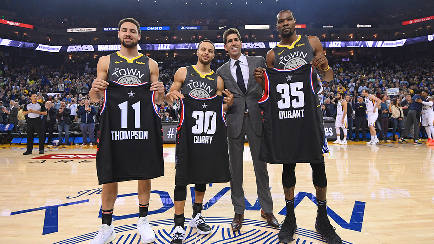

# Image to JSON: Multimodal Structured Output with Llama 3.2 Vision, MAX Serve and Pydantic

In this recipe, we will cover:

* How to run a multimodal vision model using Llama 3.2 Vision and MAX Serve
* Implementing structured output parsing with Pydantic models
* Converting image analysis into strongly-typed JSON

We'll walk through building a solution that showcases:

* MAX Serve capabilities with multimodal models
* Structured output parsing with type safety
* Simple deployment using magic CLI

Let's get started.

## Requirements

Please make sure your system meets our [system requirements](https://docs.modular.com/max/get-started).

To proceed, ensure you have the `magic` CLI installed:

```bash
curl -ssL https://magic.modular.com/ | bash
```

or update it via:

```bash
magic self-update
```

You'll need:

* Access to [meta-llama/Llama-3.2-11B-Vision-Instruct](https://huggingface.co/meta-llama/Llama-3.2-11B-Vision-Instruct) model
* A valid [Hugging Face token](https://huggingface.co/settings/tokens) for accessing Llama 3.2 Vision

Set up your environment variables:

```bash
export HUGGING_FACE_HUB_TOKEN=<your-token-yere>
```

### GPU requirements

**Structured output with MAX Serve requires GPU access**. For running the app on GPU, ensure your system meets these GPU requirements:

* Supported GPUs: NVIDIA A100 (optimized), A10G, L4, or L40
* NVIDIA Drivers: [Installation guide here](https://www.nvidia.com/download/index.aspx)
* NVIDIA Container Toolkit: [Installation guide here](https://docs.nvidia.com/datacenter/cloud-native/container-toolkit/install-guide.html)

## Quick start

1. Download the code for this recipe using git:

    ```bash
    magic init max-serve-multimodal-structured-output --from modular/max-recipes/max-serve-multimodal-structured-output
    cd max-serve-multimodal-structured-output
    ```

2. Running the vision model:

    ```bash
    magic run app
    ```

    This will start MAX Serve with Llama 3.2 Vision and run the example code that extracts player information from a basketball image.

    

    The output will look like:

    ```json
    {
    "players": [
        {
        "name": "Klay Thompson",
        "number": 11
        },
        {
        "name": "Stephen Curry",
        "number": 30
        },
        {
        "name": "Kevin Durant",
        "number": 35
        }
    ]
    }
    ```

3. And once done, to clean up the resources run:

    ```bash
    magic run clean
    ```

## Features of Llama 3.2 Vision structured output

* **Multimodal processing**: Handles both image and text inputs seamlessly
* **OpenAI-compatible API**: Works with standard OpenAI client libraries
* **Type-safe output**: Uses Pydantic models to ensure structured and validated JSON output

## Structured output with Pydantic

The core of our structured output system uses Pydantic models to define the expected data structure:

```python
from pydantic import BaseModel

class Player(BaseModel):
    name: str = Field(description="Player name on jersey")
    number: int = Field(description="Player number on jersey")

class Players(BaseModel):
    players: List[Player] = Field(description="List of players visible in the image")
```

How it works:

* **Type validation**: Pydantic ensures all fields match their expected types
* **Field descriptions**: Help guide the model in extracting the right information
* **Nested structures**: Support complex data hierarchies for detailed information extraction

### Vision model integration

The application uses the OpenAI client to communicate with MAX Serve:

```python
from openai import OpenAI

client = OpenAI(api_key="local", base_url="http://localhost:8000/v1")

completion = client.beta.chat.completions.parse(
    model="meta-llama/Llama-3.2-11B-Vision-Instruct",
    messages=[
        {"role": "system", "content": "Extract player information from the image."},
        {"role": "user", "content": [
            {
                "type": "text",
                "text": "Please provide a list of players visible in this photo with their jersey numbers."
            },
            {
                "type": "image_url",
                "image_url": {
                    "url": "https://ei.marketwatch.com/Multimedia/2019/02/15/Photos/ZH/MW-HE047_nbajer_20190215102153_ZH.jpg"
                }
            }
        ]},
    ],
    response_format=Players,
)
```

Key components:

* **Multimodal input**: Combines text instructions with image data
* **Structured parsing**: Uses the Players model to format the response
* **Inference**: Runs on MAX Serve with OpenAI-compatible API

### MAX Serve Options

To enable structured output in MAX Serve, simply include `--enable-structured-output`.

To see other options, make sure to check out the help:

```bash
max-pipelines serve --help
```

## Conclusion

In this recipe, we've built a system for extracting structured data from images using Llama 3.2 Vision and MAX Serve. We've explored:

* **Basic setup**: Using MAX Serve with GPU support
* **Structured output**: Implementing type-safe data extraction with Pydantic
* **Multimodal processing**: Handling both image and text inputs
* **Local deployment**: Running the model with MAX Serve

This implementation provides a foundation for building more complex vision-based applications with structured output.

## Next steps

* Deploy Llama 3.2 Vision on GPU with MAX Serve to [AWS, GCP or Azure](https://docs.modular.com/max/tutorials/max-serve-local-to-cloud/) or on [Kubernetes](https://docs.modular.com/max/tutorials/deploy-max-serve-on-kubernetes/)
* Explore MAX's [documentation](https://docs.modular.com/max/) for additional features
* Join our [Modular Forum](https://forum.modular.com/) and [Discord community](https://discord.gg/modular) to share your experiences and get support

We're excited to see what you'll build with Llama 3.2 Vision and MAX! Share your projects and experiences with us using `#ModularAI` on social media.
