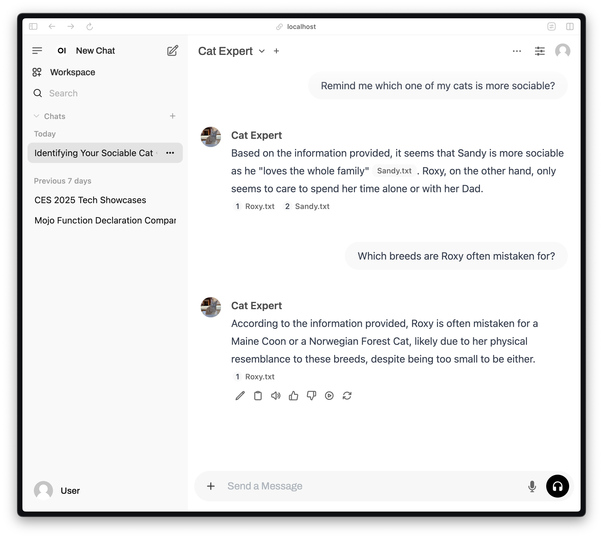

# Use Open WebUI with MAX

Building on the solid foundation MAX provides, adding a robust user interface is a natural next step.



In this recipe you will:

- Use MAX Serve to provide an OpenAI-compatible endpoint for [Llama 3.1](https://ai.meta.com/blog/meta-llama-3-1/)
- Set up [Open WebUI](https://github.com/open-webui/open-webui) to provide a robust chat interface
- Learn how Open WebUI's RAG and Web search functionality works
- Learn how to reconfigure this recipe for use with multiple users

## About Open WebUI

Open WebUI is a powerful platform offering a familiar chat interface for interacting with open-source AI models. Like MAX, Open WebUI empowers users to maintain complete ownership of their AI infrastructure, avoiding vendor lock-in risks, and enhancing privacy. In fact, we often use Open WebUI with our own work at Modular because of how seamlessly it integrates with MAX. We think you'll like it too.

## Requirements

Please make sure your system meets our [system requirements](https://docs.modular.com/max/get-started).

To proceed, ensure you have the `magic` CLI installed with the `magic --version` to be **0.7.2** or newer:

```bash
curl -ssL https://magic.modular.com/ | bash
```

...and updated to the latest version:

```bash
magic self-update
```

Then install `max-pipelines` via:

```bash
magic global install max-pipelines=="25.2.0.dev2025031705"
```

For this recipe, you will need a valid [Hugging Face token](https://huggingface.co/settings/tokens) to access the model.
Once you have obtained the token, include it in `.env` by running:

```bash
cp .env.example .env
```

...then add your token in the `.env` file:

```bash
HUGGING_FACE_HUB_TOKEN=
```

## Quick start

1. Download the code for this recipe using the `magic` CLI:

    ```bash
    magic init max-serve-open-webui --from modular/max-recipes/max-serve-open-webui
    cd max-serve-open-webui
    ```

2. Start MAX and Open WebUI with one command:

    ```bash
    magic run app
    ```

This command is defined in the `pyproject.toml` file which we cover later.

MAX Serve is ready once you see a line containing the following in the log output:

```plaintext
Server running on http://0.0.0.0:8000/
```

Open WebUI is ready once you see a line containing the following in the log output:

```plaintext
Uvicorn running on http://0.0.0.0:8080/
```

Once both servers are ready, launch the Open WebUI URL in your browser.

## Using Open WebUI

This receipe includes a pre-configured Open WebUI database (located in the `data` folder). It runs in single-user mode, bypassing user account creation and sign-in. If you you decide to deploy this Open WebUI recipe for multiple users, see the [instructions below](#multi-user-support).

### Retrieval-augmented generation (RAG)

RAG is a popular pattern for providing a model with knowledge not present in its pre-training dataset. It's especially useful for accessing knowledge that's not publicly available on the Web.

To demonstrate RAG, this recipe includes a pre-configured knowledge base along with what Open WebUI refers to as a *custom model*.

Here's how it works:

- Navigate to *Workspace > Models* to view / edit the *DevRel Pets* custom model. Here you can choose the base model, modify the system prompt, and select the knowledge base to use.

- Navigate to *Workspace > Knowledge > DevRel Pets (Demo)* to view / edit the knowledge base itself.

To chat with the custom model, start a new chat, then choose *DevRel Pets* from the model picker.

### Web search

Web search is another pattern for providing a model with new information, in this case up-to-date world knowledge from the public Web.

This recipe is pre-configured to use [DuckDuckGo](https://duckduckgo.com/) for web search. To use a different web search service, navigate to *Admin Panel > Settings > Web Search*. Some services require you provide an API key and payment information, while using DuckDuckGo's API is open and free.

To chat with real-time access to information from the Web, simply start a new chat, and enable *Web Search* in the message input box.

## Understand the project

### Environments

This project is configured in the `pyproject.toml` file, and the tasks executed with `magic run app` are defined in the [Procfile](https://judoscale.com/blog/six-tips-for-mastering-your-procfile). The project uses [Honcho](https://honcho.readthedocs.io/en/latest/) to run and monitor MAX and Open WebUI concurrently.

Because MAX and Open WebUI each depend on different versions of several common libraries, we use the `magic` CLI to define separate environments for each; this is why you'll see `ui` and `max` throughout the `pyproject.toml`. Further notes on this configuration are contained within code comments in `pyproject.toml`.

**Note:** In the future, we plan to update this recipe to use Docker Compose.

### Multi-user support

**Important:** If you decide to use this recipe to deploy Open WebUI  for multiple users, we recommend the following:

1. Delete the `data` folder
2. Open `pyproject.toml`, locate the `tool.pixi.feature.ui.tasks` section, and change `WEBUI_AUTH = "false"` to `"true"`

## What's next?

Now that you're up and running with Open WebUI on MAX, you can explore more features and join our developer community. Here are some resources to help you continue your journey:

- [Get started with MAX](https://docs.modular.com/max/get-started)
- Explore [MAX Serve](https://docs.modular.com/max/serve) and [MAX Container](https://docs.modular.com/max/container/)
- Learn more about `magic` CLI in this [Magic tutorial](https://docs.modular.com/max/tutorials/magic)
- Join the [Modular forum](https://forum.modular.com/)
