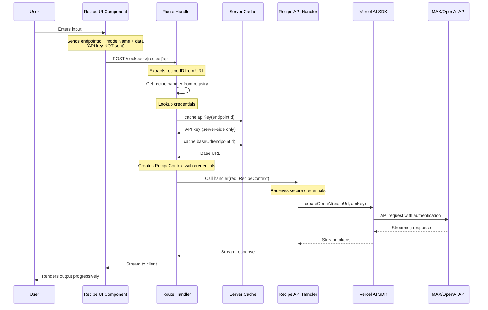

# Architecture Guide

This guide explains the design decisions and patterns used throughout the Modular Agentic Cookbook.

## Overview

The Agentic Cookbook is a **monorepo** built with pnpm workspaces, organizing code into a Next.js web application and shared recipe implementations.

**Key benefits:**
- **Code reuse** - Recipes shared between web app and potential future consumers
- **Type safety** - End-to-end TypeScript with shared types
- **Hot module reloading** - Fast development iteration
- **Separation of concerns** - Clear boundaries between UI, API, and business logic

## Directory Structure

```plaintext
max-recipes/
├── apps/cookbook/              # Next.js 14 App with App Router
│   ├── app/
│   │   ├── api/                # API routes (endpoints, models)
│   │   ├── cookbook/[recipe]/  # Dynamic recipe routes
│   │   └── ...
│   ├── components/             # Reusable UI components
│   ├── context/                # React Context (global state)
│   └── utils/                  # Utilities (cache, theme, constants)
│
├── packages/recipes/           # Shared recipe implementations
│   ├── src/
│   │   ├── [recipe-name]/      # Each recipe: ui.tsx + api.ts
│   │   ├── registry/           # Recipe registration system
│   │   ├── types.ts            # Shared TypeScript types
│   │   └── utils.ts            # Shared utilities
│   ├── index.ts                # Client-side exports
│   └── server.ts               # Server-side exports
│
├── docs/                       # Documentation
└── archive/                    # Legacy recipes (archived)
```

See the full directory tree in the [repository root](https://github.com/modular/max-recipes).

## Core Concepts

### 1. Monorepo with pnpm Workspaces

The cookbook uses [pnpm workspaces](https://pnpm.io/workspaces) for efficient dependency management across multiple packages. See [`pnpm-workspace.yaml`](../pnpm-workspace.yaml).

**Why pnpm?**
- Fast and efficient dependency resolution
- Excellent monorepo support
- Strict dependency management
- Wide adoption in the ecosystem

### 2. Recipe System

Recipes are the building blocks of the cookbook. Each recipe consists of two files:

- **`ui.tsx`** - Frontend React component (user interface, state, API calls)
- **`api.ts`** - Backend handler (request processing, LLM communication, streaming)

**Recipe registration:** Recipes are registered in three registries:
- **Metadata** ([`metadata.ts`](../packages/recipes/src/registry/metadata.ts)) - Name, description, tags
- **API handlers** ([`api.ts`](../packages/recipes/src/registry/api.ts)) - Server-side POST functions
- **UI components** ([`ui.ts`](../packages/recipes/src/registry/ui.ts)) - Client-side React components

### 3. Next.js App Router

The cookbook uses Next.js 14's [App Router](https://nextjs.org/docs/app) for:
- Server components (reduced client bundle)
- Streaming and React Server Components
- Built-in API routes
- Simplified data fetching

**Key routes:**
- [`app/cookbook/[recipe]/page.tsx`](../apps/cookbook/app/cookbook/[recipe]/page.tsx) - Renders recipe UI
- [`app/cookbook/[recipe]/api/route.ts`](../apps/cookbook/app/cookbook/[recipe]/api/route.ts) - Recipe API endpoint
- [`app/cookbook/[recipe]/code/page.tsx`](../apps/cookbook/app/cookbook/[recipe]/code/page.tsx) - Code viewer

### 4. Global State Management

React Context ([`CookbookProvider`](../apps/cookbook/context/CookbookProvider.tsx)) manages:
- Selected endpoint ID
- Selected model name
- Available endpoints (without API keys)

Components access state via the `useCookbook()` hook.

### 5. RecipeContext: Secure Credential Passing

`RecipeContext` is the bridge between the cookbook app and recipe handlers, providing secure API access.

**Interface** ([`types.ts`](../packages/recipes/src/types.ts)):
```typescript
export interface RecipeContext {
    baseUrl: string    // LLM endpoint URL
    apiKey: string     // API key (server-side only)
    modelName: string  // Selected model name
}
```

**Flow:**
1. Client sends `endpointId` (e.g., "max-local") to API route
2. Route handler looks up credentials from server-side cache
3. Handler creates `RecipeContext` with full credentials
4. Recipe receives context and uses credentials to call LLM

**Security:** API keys never leave the server. Client only knows endpoint IDs.

### 6. Server-Side Cache

The [`cache.ts`](../apps/cookbook/utils/cache.ts) module securely stores endpoint credentials server-side.

**Key features:**
- Singleton pattern using `globalThis` (preserves across hot reload in dev)
- Methods: `cache.apiKey(id)`, `cache.baseUrl(id)`
- Populated from `COOKBOOK_ENDPOINTS` environment variable
- Credentials never exposed to client

**Usage:** Route handlers use cache to lookup credentials by endpoint ID before calling recipe handlers.

## Data Flow

### Recipe Execution



**Security checkpoints:**
- ✅ Client never sees API keys
- ✅ Cache validates endpoint IDs
- ✅ Route handler validates recipe exists
- ✅ Credentials passed via server-only RecipeContext

### Configuration Flow

```mermaid
flowchart TD
    ENV[".env.local<br/>(COOKBOOK_ENDPOINTS with API keys)"] --> STARTUP[Server Startup]
    STARTUP --> CACHE[Cache.set endpoints<br/>API keys stored server-side]

    CACHE --> API_ROUTE["/api/endpoints route"]

    Note1["🔒 Security boundary:<br/>API keys stripped here"] -.-> API_ROUTE

    API_ROUTE -->|"Sends: {id, baseUrl}<br/>(NO API keys)"| PROVIDER[CookbookProvider<br/>React Context]

    PROVIDER -->|"Stores endpoint IDs only"| UI[Recipe UI Components]

    UI -->|"POST with endpointId"| ROUTE[Route Handler]

    ROUTE -->|"cache.apiKey(endpointId)"| CACHE
    CACHE -->|"Returns API key"| ROUTE

    ROUTE -->|"Creates RecipeContext<br/>{apiKey, baseUrl, modelName}"| RECIPE[Recipe Handler]

    RECIPE -->|"Uses credentials securely"| LLM[LLM API]

    style Note1 fill:#fff3cd,stroke:#ffc107,stroke-width:2px
    style CACHE fill:#d4edda,stroke:#28a745,stroke-width:2px
    style ENV fill:#d4edda,stroke:#28a745,stroke-width:2px
    style RECIPE fill:#d4edda,stroke:#28a745,stroke-width:2px
    style UI fill:#cce5ff,stroke:#004085,stroke-width:2px
    style PROVIDER fill:#cce5ff,stroke:#004085,stroke-width:2px
```



**Key principle:** API keys flow one direction (environment → cache → RecipeContext) and never to the client.

## Security Model

### API Key Protection

**Server-side storage:**
- API keys stored in cache ([`cache.ts`](../apps/cookbook/utils/cache.ts))
- Populated from `.env.local` at startup
- Never serialized or sent to client

**Request flow:**
1. Client sends endpoint ID (not credentials)
2. Route handler validates ID exists in cache
3. Handler looks up credentials: `cache.apiKey(endpointId)`
4. Handler creates RecipeContext with credentials
5. Recipe uses credentials to call LLM endpoint
6. API key never leaves server

**Environment variables:**
- Secrets in `.env.local` (gitignored)
- Template: `.sample.env`
- Format: `COOKBOOK_ENDPOINTS` JSON array

### Input Validation

- **TypeScript** - Enforces types throughout
- **Request sanitization** - Validated in API handlers
- **Error boundaries** - Catch UI errors gracefully
- **Endpoint validation** - Returns 502 if not found
- **Recipe validation** - Returns 404 if not found

## Technology Choices

### Why Next.js App Router?
- Server components reduce client bundle size
- Streaming and React Server Components support
- Built-in API routes with minimal boilerplate

### Why Vercel AI SDK?
- Streaming-first design (progressive token delivery)
- OpenAI-compatible API support (works with MAX)
- React hooks for seamless UI integration

### Why Mantine UI?
- Comprehensive component library
- Built-in dark mode
- Accessible by default
- Minimal bundle size impact

### Why pnpm?
- Fast and efficient (better than npm/yarn)
- Excellent monorepo support
- Strict dependency management (prevents phantom dependencies)

## Performance

### Code Splitting
- Recipe UI components lazy-loaded
- Next.js automatically splits by route
- Shared dependencies bundled once

### Caching
- Server-side: Endpoint configurations cached
- Build-time: Static assets pre-compressed

### Streaming
- Token streaming (progressive LLM responses)
- NDJSON streaming (batch operations)

## Future Considerations

### Scalability
- Recipe plugin system (dynamic loading)
- Distributed caching (Redis for multi-instance)
- Observability (logging and monitoring)

### Extensibility
- Custom UI themes (theme marketplace)
- Recipe marketplace (community contributions)
- LLM provider plugins (beyond OpenAI-compatible)

### Developer Experience
- Recipe CLI (scaffolding tool)
- Hot reloading improvements
- Better error messages

## Related Documentation

- [Docker Deployment Guide](./docker.md) - Container deployment, GPU support
- [Contributing Guide](./contributing.md) - How to add recipes, code standards
- [Main README](../README.md) - Quick start, featured recipes
