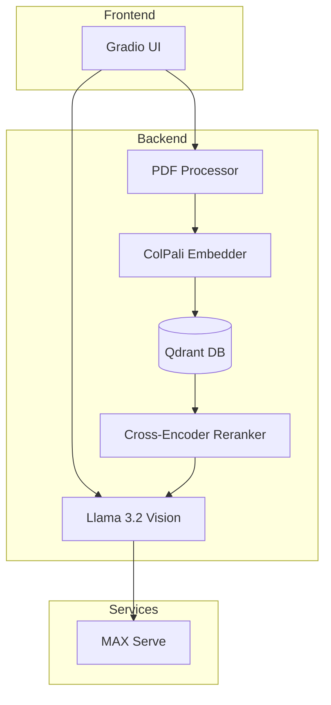
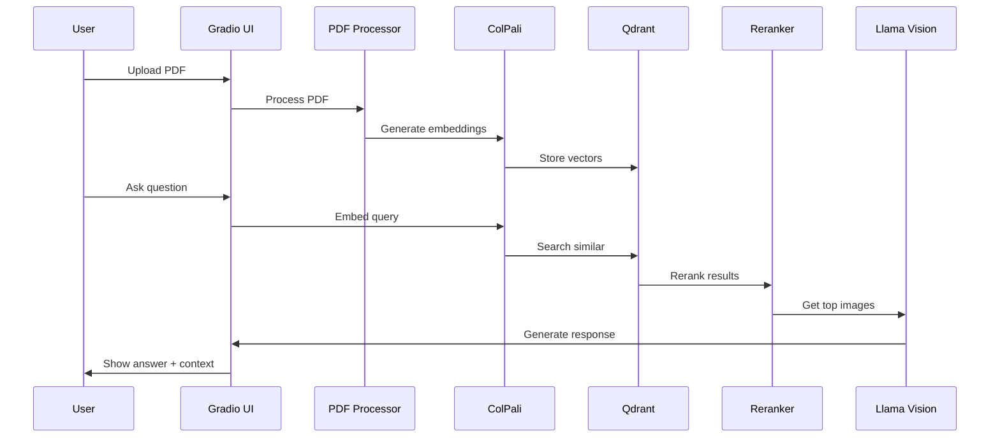

# Learn How to Build Multi-Modal RAG with Colpali, Llama3.2-Vision, Qdrant, Reranker and MAX Serve

This recipe demonstrates how to build a powerful multi-modal RAG (Retrieval Augmented Generation) system on PDF that combines:

* [ColPali](https://huggingface.co/vidore/colpali-v1.3) for generating embeddings from PDF images
* [Qdrant vector database](https://qdrant.tech/documentation/quickstart/) for efficient similarity search
* [meta-llama/Llama-3.2-11B-Vision](https://huggingface.co/meta-llama/Llama-3.2-11B-Vision) for visual question answering
* [AnswerDotAI/rerankers](https://github.com/AnswerDotAI/rerankers) for enhancing retrieval with cross-encoder reranking
* [MAX Serve](https://docs.modular.com/max/serve/) for efficient model serving and inference
* [Gradio](https://www.gradio.app/) for an intuitive user interface

While this recipe focuses on PDF documents, the patterns demonstrated here can be adapted for various multi-modal applications like:

* **Technical documentation search**
* **Visual product catalogs**
* **Educational content retrieval**
* **Legal document analysis**
* **Medical image analysis and reporting**

## Requirements

Please make sure your system meets our [system requirements](https://docs.modular.com/max/get-started).

### Important: Model Access Requirements

1. **Meta Llama Model Access**
   * Accept the license agreement to access [meta-llama/Llama-3.2-11B-Vision-Instruct](https://huggingface.co/meta-llama/Llama-3.2-11B-Vision-Instruct)

2. **HuggingFace Token**
   * A valid Hugging Face access token at [https://huggingface.co/settings/tokens]
   * Set the token in your environment:

     ```bash
     export HUGGING_FACE_HUB_TOKEN=your_token_here
     ```

### GPU Requirements

This recipe requires a GPU with at least 35GB of VRAM to run efficiently. Recommended GPUs:

* NVIDIA A100 (40GB/80GB)
* NVIDIA A40 (48GB)
* NVIDIA L40 (48GB)

To proceed, ensure you have the `magic` CLI installed:

```bash
curl -ssL https://magic.modular.com/ | bash
```

or update it via:

```bash
magic self-update
```

## Quick start

1. Download the code for this recipe using git:

    ```bash
    magic init multimodal-rag-with-colpali-llamavision-reranker --from modular/max-recipes/multimodal-rag-with-colpali-llamavision-reranker
    cd multimodal-rag-with-colpali-llamavision-reranker
    ```

2. Run the application:

    ```bash
    magic run app
    ```

    This command will:
    * Start MAX Serve with `meta-llama/Llama-3.2-11B-Vision` on port `8010`
    * Launch Qdrant vector database on port `6333`
    * Start the Gradio interface on port `7860`

3. Open [http://localhost:7860](http://localhost:7860) in your browser to see the UI.

    In this demo, we upload [The Little Book of Deep Learning](https://fleuret.org/public/lbdl.pdf), which contains 185 pages that are parsed as images for question answering:

    

4. To clean up resources when done:

    ```bash
    magic run clean
    ```

## System architecture



The architecture consists of several key components:

1. **Frontend**: Gradio interface for PDF upload and Q&A
2. **Backend Processing**:
   * PDF image extraction
   * ColPali embedding generation
   * Qdrant vector storage
3. **Question Answering**:
   * Similarity search in Qdrant
   * Visual analysis with Llama 3.2 Vision
   * Response generation

## Request flow

Here's how a typical query flows through the system:



1. **PDF Upload and Processing**:
   * PDF is converted to high-quality images
   * Images are embedded using ColPali
   * Embeddings stored in Qdrant

2. **Query Processing**:
   * User question is embedded
   * Similar images retrieved from Qdrant
   * Results reranked by cross-encoder
   * Top images sent to Llama Vision
   * Response generated with visual context

## Technical deep dive

### Pdf processing and embedding

The system processes PDFs in multiple stages:

```python
class PDFProcessor:
    def __init__(self, temp_dir="./temp_images"):
        self.temp_dir = temp_dir
        os.makedirs(temp_dir, exist_ok=True)

    def extract_images(self, pdf_path):
        """Extract images from PDF file"""
        images = []
        doc = fitz.open(pdf_path)

        for page_num in range(len(doc)):
            page = doc.load_page(page_num)
            pix = page.get_pixmap(matrix=fitz.Matrix(300/72, 300/72))
            img = Image.open(BytesIO(pix.tobytes()))
            images.append(img)

        return images
```

Key features:

* High-resolution image extraction (300 DPI)
* Efficient memory management
* Temporary storage handling

### Embedding generation

The ColPali model generates embeddings for both images and queries:

```python
class EmbedData:
    def __init__(self, embed_model_name=EMBEDDING_MODEL, batch_size=BATCH_SIZE):
        self.embed_model_name = embed_model_name
        self.batch_size = batch_size
        self.embeddings = []
        self.embed_model, self.processor = self._load_embed_model()
```

Optimizations include:

* Batch processing for efficiency
* Automatic mixed precision (AMP)
* CUDA memory management
* Efficient tensor operations

### Vector database management

Qdrant handles vector storage and retrieval:

```python
class QdrantVectorDB:
    def __init__(self, collection_name, vector_dim=128, batch_size=4):
        self.collection_name = collection_name
        self.batch_size = batch_size
        self.vector_dim = vector_dim
        self.client = QdrantClient(url=QDRANT_URL, prefer_grpc=True)
```

Features:

* gRPC communication for speed
* Batch ingestion support
* Automatic collection management
* Efficient similarity search

### Retrieval and reranking

The system uses a two-stage retrieval process with ColPali embeddings and cross-encoder reranking:

```python
class Retriever:
    def __init__(self, vector_db, embed_data, use_reranker=True):
        self.vector_db = vector_db
        self.embed_data = embed_data
        self.use_reranker = use_reranker

        if self.use_reranker:
            logger.info("Initializing reranker...")
            self.reranker = Reranker('cross-encoder')
            logger.info("Reranker initialized successfully")

    def search(self, query, display_limit=3, initial_fetch=10):
        """Two-stage retrieval with reranking"""
        # First stage: Semantic search with ColPali embeddings
        query_embedding = self.embed_data.get_query_embedding(query)
        results = self.vector_db.client.query_points(
            collection_name=self.vector_db.collection_name,
            query_vector=query_embedding,
            limit=initial_fetch  # Fetch more candidates for reranking
        )

        if self.use_reranker and results:
            try:
                # Second stage: Cross-encoder reranking
                docs = [f"Page {result.id}" for result in results]
                doc_ids = [result.id for result in results]

                reranked = self.reranker.rank(
                    query=query,
                    docs=docs,
                    doc_ids=doc_ids
                )

                # Get top K after reranking
                top_results = reranked.top_k(display_limit)

                # Map back to original results
                final_results = []
                for reranked_result in top_results:
                    for orig_result in results:
                        if orig_result.id == reranked_result.doc_id:
                            final_results.append(orig_result)
                            break

                return models.QueryResponse(points=final_results)
            except Exception as e:
                logger.warning(f"Reranking failed: {e}. Using original order.")
                return models.QueryResponse(points=results[:display_limit])

        return models.QueryResponse(points=results[:display_limit])
```

Key features:

* Two-stage retrieval pipeline
* Initial broad retrieval with ColPali embeddings
* Cross-encoder reranking for better precision
* Configurable result limits
* Graceful fallback on reranker errors

The reranking process:

1. Initial retrieval gets more candidates than needed (e.g., top 10)
2. Cross-encoder reranker scores each candidate more accurately
3. Top K results after reranking are returned
4. System maintains original result metadata through the process

### Gradio interface

The UI provides an intuitive interface:

```python
class UI:
    def __init__(self):
        self.pdf_processor = PDFProcessor()
        self.embed_data = EmbedData(batch_size=BATCH_SIZE)
        self.vector_db = QdrantVectorDB(...)
        self.retriever = Retriever(...)
        self.rag = RAG(...)
```

Features:

* Real-time PDF processing
* Interactive Q&A interface
* Context image display
* Status updates

### RAG implementation

The RAG system combines retrieval results with Llama 3.2 Vision for answer generation:

```python
class RAG:
    def __init__(self, retriever):
        self.retriever = retriever
        self.llm_client = client

    def generate_context(self, query, display_limit=5, llm_limit=2):
        """Retrieve and prepare context for LLM"""
        results = self.retriever.search(query, display_limit=display_limit)
        context_images = []
        page_info = []

        for result in results.points:
            image_b64 = result.payload.get("image")
            if image_b64:
                context_images.append(image_b64)
                page_info.append(f"Page {result.id}")

        return context_images, page_info, llm_limit

    def query(self, query):
        """Generate response using RAG with Llama 3.2 Vision"""
        context_images, page_info, llm_limit = self.generate_context(query)

        # Prepare messages with images for LLM
        messages = [
            {"role": "system", "content": SYSTEM_PROMPT},
            {"role": "user", "content": [
                {"type": "text", "text": query}
            ]}
        ]

        # Add context images to the message
        for img_b64 in context_images[:llm_limit]:
            messages[1]["content"].append({
                "type": "image_url",
                "image_url": {
                    "url": f"data:image/jpeg;base64,{img_b64}"
                }
            })

        response = self.llm_client.chat.completions.create(
            model="meta-llama/Llama-3.2-11B-Vision-Instruct",
            messages=messages,
            max_tokens=1024,
            temperature=0.3
        )

        return response.choices[0].message.content, page_info
```

Key features:

* Dynamic context selection
* Efficient image preprocessing
* Structured prompt engineering
* Temperature control for consistent responses

## Customization options

You can customize the system in several ways:

### 1. Model configuration

```python
# Change embedding model
EMBEDDING_MODEL = "vidore/colpali-v1.3"  # Try different ColPali versions

# Adjust batch processing
BATCH_SIZE = 8  # Increase/decrease based on GPU memory

# Modify LLM parameters
temperature = 0.3  # Higher for more creative responses
max_tokens = 1024  # Adjust response length
```

### 2. Retrieval settings

```python
class Retriever:
    def search(self, query, display_limit=3, initial_fetch=10):
        # Adjust number of candidates for reranking
        initial_fetch = 10  # More candidates = better results but slower

        # Configure reranker
        self.reranker = Reranker(
            'cross-encoder',
            model_name='cross-encoder/ms-marco-MiniLM-L-6-v2'
        )
```

### 3. PDF processing

```python
class PDFProcessor:
    def extract_images(self, pdf_path):
        # Adjust image quality
        matrix = fitz.Matrix(300/72, 300/72)  # Change DPI

        # Modify image format
        img.save(buffered, format="JPEG", quality=85)  # Adjust quality
```

### 4. UI customization

```python
# Customize Gradio interface
custom_css = """
    .gradio-container {
        font-family: 'Segoe UI', Arial, sans-serif;
    }
    .gr-button {
        background-color: #1f6feb !important;
    }
"""

# Adjust gallery display
context_gallery = gr.Gallery(
    label="Context Images",
    columns=2,  # Change layout
    height="auto"
)
```

## Troubleshooting

Common issues and solutions:

1. **GPU Memory Issues**
   * Error: "CUDA out of memory"
   * Solution: Reduce `BATCH_SIZE` in configuration
   * Ensure no other GPU processes are running

2. **PDF Processing Issues**
   * Error: "No images found in PDF"
   * Solution: Check PDF quality and format
   * Try adjusting DPI settings in PDFProcessor

3. **Qdrant Connection Issues**
   * Error: "Failed to connect to Qdrant"
   * Solution: Ensure Docker is running
   * Check ports 6333 and 6334 are available

4. **MAX Serve Issues**
   * Error: "Connection refused to MAX Serve"
   * Solution: Ensure MAX Serve is running
   * Check GPU requirements are met

## Next steps

Now that you've built a multi-modal RAG system, you can:

1. **Enhance the System**
   * Add support for more document formats (Word, HTML, etc.)
   * Implement caching for faster responses
   * Add text-based LLM for pure text queries
   * Add evaluation metrics for RAG quality
   * Implement streaming responses
   * Add memory for chat history context

2. **Deploy to Production**
   * Deploy MAX Serve on [AWS, GCP or Azure](https://docs.modular.com/max/tutorials/max-serve-local-to-cloud/)
   * Scale Qdrant with [cloud deployment](https://qdrant.tech/documentation/cloud/)
   * Add monitoring and observability
   * Implement rate limiting and authentication

3. **Join the Community**
   * Explore [MAX documentation](https://docs.modular.com/max/)
   * Join our [Modular Forum](https://forum.modular.com/)
   * Share your projects with `#ModularAI` on social media

We're excited to see what you'll build with this foundation!
